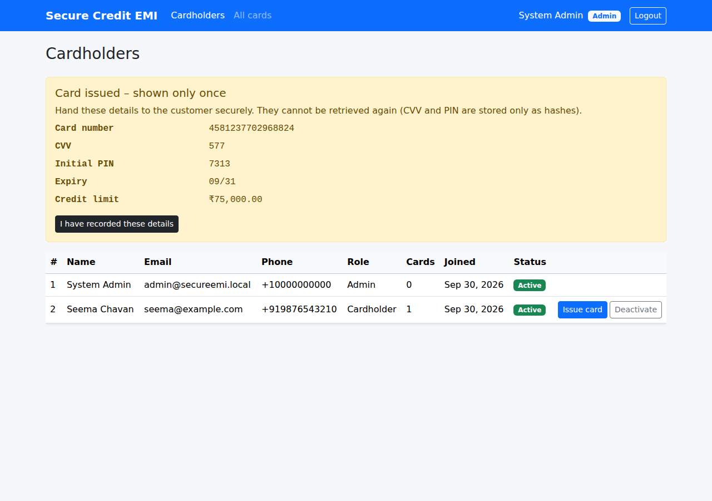
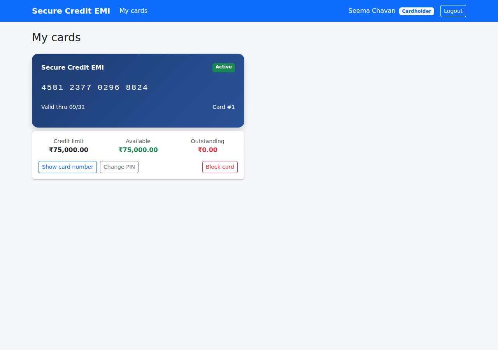

# Module 1 – Foundation + Cardholder & Card Lifecycle Management

**Goal of this module:** build the skeleton that every later module plugs into, and deliver the first
business capability from the specification:

> *Cardholder & Lifecycle Management: customer onboarding, secure card issuance, credit limit
> assignment, dynamic balance calculation, and card status controls (Active/Blocked).*
> *CVV & PIN Security: cryptographically hashed CVV and PIN setup workflows with strict validation policies.*

At the end of this module you can:

- register as a customer and log in (JWT),
- log in as a bank **Admin**, see all customers and **issue a card** with a credit limit,
- see the card number, CVV and initial PIN **exactly once** (like a PIN mailer),
- as the customer, **change the PIN**, **reveal the full card number** after PIN check, and **block** the card,
- as Admin, **unblock** cards and **change credit limits**.

| Admin issues a card | Cardholder sees the card (number revealed after PIN check) |
|---|---|
|  |  |

---

## Contents

1. [The big picture: Clean Architecture](#step-1--the-big-picture-clean-architecture)
2. [Create the solution and projects](#step-2--create-the-solution-and-projects)
3. [Database script (SQL Server)](#step-3--database-script-sql-server)
4. [Domain layer – entities and business rules](#step-4--domain-layer)
5. [Application layer – use cases, DTOs, validation](#step-5--application-layer)
6. [Infrastructure layer – EF Core, repositories, cryptography, JWT](#step-6--infrastructure-layer)
7. [API layer – controllers, middleware, security pipeline](#step-7--api-layer)
8. [Configuration and secrets](#step-8--configuration-and-secrets)
9. [Unit tests](#step-9--unit-tests)
10. [Angular client](#step-10--angular-client)
11. [Run it and try it](#step-11--run-it-and-try-it)
12. [Security checklist for this module](#step-12--security-checklist)
13. [What comes next](#whats-next--module-2)

---

## Step 1 – The big picture: Clean Architecture

The spec asks for four backend layers plus the Angular SPA. The golden rule of Clean Architecture is
that **dependencies only point inwards**:

```
          ┌──────────────────────────────────────────────┐
          │  Angular SPA  (HTTP + JWT)                    │
          └───────────────────────┬──────────────────────┘
                                  │ HTTPS / JSON
┌─────────────────────────────────▼──────────────────────────────────┐
│ SecureEmiCard.Api          Controllers, auth, rate limit, errors    │
└─────────────────────────────────┬──────────────────────────────────┘
                                  │ references
┌─────────────────────────────────▼──────────────────────────────────┐
│ SecureEmiCard.Infrastructure   EF Core DbContext, repositories,     │
│                                AES-GCM, PBKDF2, JWT generator       │
└─────────────────────────────────┬──────────────────────────────────┘
                                  │ implements interfaces of
┌─────────────────────────────────▼──────────────────────────────────┐
│ SecureEmiCard.Application      Services (use cases), DTOs,          │
│                                validators, INTERFACES               │
└─────────────────────────────────┬──────────────────────────────────┘
                                  │ uses
┌─────────────────────────────────▼──────────────────────────────────┐
│ SecureEmiCard.Domain           Entities + business rules (pure C#)  │
└────────────────────────────────────────────────────────────────────┘
```

Why this matters for a banking app:

- **Domain** has zero dependencies – rules such as *"credit limit can never drop below what is already
  spent"* live here and are trivially unit-testable.
- **Application** says *what* must happen (e.g. "hash the PIN") through interfaces like
  `ISecretHasher`, but not *how*. You can swap SQL Server for Azure SQL, or PBKDF2 for an HSM, without
  touching business code.
- **Infrastructure** contains everything that talks to the outside world (database, crypto libraries).
- **Api** is a thin shell: HTTP in, call a service, HTTP out.

---

## Step 2 – Create the solution and projects

These are the exact commands used to create `backend/` (you don't need to run them again – they are
here so you understand how the solution was built):

```bash
mkdir backend && cd backend
dotnet new sln -n SecureEmiCard

dotnet new classlib -n SecureEmiCard.Domain         -o src/SecureEmiCard.Domain         -f net8.0
dotnet new classlib -n SecureEmiCard.Application    -o src/SecureEmiCard.Application    -f net8.0
dotnet new classlib -n SecureEmiCard.Infrastructure -o src/SecureEmiCard.Infrastructure -f net8.0
dotnet new webapi   -n SecureEmiCard.Api            -o src/SecureEmiCard.Api            -f net8.0 --use-controllers
dotnet new xunit    -n SecureEmiCard.UnitTests      -o tests/SecureEmiCard.UnitTests    -f net8.0
dotnet sln add src/*/*.csproj tests/*/*.csproj

# Project references = the arrows in the diagram above
dotnet add src/SecureEmiCard.Application    reference src/SecureEmiCard.Domain
dotnet add src/SecureEmiCard.Infrastructure reference src/SecureEmiCard.Application
dotnet add src/SecureEmiCard.Api            reference src/SecureEmiCard.Infrastructure
dotnet add tests/SecureEmiCard.UnitTests    reference src/SecureEmiCard.Application src/SecureEmiCard.Infrastructure

# NuGet packages
dotnet add src/SecureEmiCard.Application    package FluentValidation
dotnet add src/SecureEmiCard.Application    package FluentValidation.DependencyInjectionExtensions
dotnet add src/SecureEmiCard.Infrastructure package Microsoft.EntityFrameworkCore.SqlServer --version 8.0.11
dotnet add src/SecureEmiCard.Infrastructure package Microsoft.EntityFrameworkCore.InMemory  --version 8.0.11
dotnet add src/SecureEmiCard.Infrastructure package System.IdentityModel.Tokens.Jwt
dotnet add src/SecureEmiCard.Api            package Microsoft.AspNetCore.Authentication.JwtBearer --version 8.0.11
```

Resulting folder structure (Module 1 files only):

```
backend/src/
├── SecureEmiCard.Domain/
│   ├── Common/DomainException.cs
│   ├── Enums/CardStatus.cs, UserRole.cs
│   └── Entities/Cardholder.cs, CreditCard.cs
├── SecureEmiCard.Application/
│   ├── Abstractions/Persistence/   ICardholderRepository, ICreditCardRepository, IUnitOfWork
│   ├── Abstractions/Security/      IPasswordHasher, ISecretHasher, ICardEncryptionService,
│   │                               IJwtTokenGenerator, ICurrentUser
│   ├── Common/Exceptions/          NotFound, Conflict, Unauthorized, Forbidden
│   ├── Features/Auth/              AuthService, DTOs, validators
│   ├── Features/Cardholders/       CardholderService
│   ├── Features/Cards/             CardService, CardNumberGenerator, PinPolicy, DTOs, validators
│   └── DependencyInjection.cs
├── SecureEmiCard.Infrastructure/
│   ├── Persistence/                AppDbContext, DbInitializer, Configurations/, Repositories/
│   ├── Security/                   AesGcmCardEncryptionService, Pbkdf2PasswordHasher,
│   │                               PepperedSecretHasher, JwtTokenGenerator, SecurityOptions
│   └── DependencyInjection.cs
└── SecureEmiCard.Api/
    ├── Controllers/                AuthController, CardsController, CardholdersController
    ├── Infrastructure/             CurrentUser, GlobalExceptionHandler, RateLimitPolicies
    ├── Program.cs
    └── appsettings*.json
```

---

## Step 3 – Database script (SQL Server)

File: [`database/01a_Database_Schema_Core_Tables.sql`](../database/01a_Database_Schema_Core_Tables.sql)

We take the spec's *Part 1* script and harden it slightly:

| Column | Stores | How |
|---|---|---|
| `Cardholders.PasswordHash` | password | `PBKDF2-SHA256$600000$<salt>$<hash>` |
| `CreditCards.CardNumberEncrypted` | full 16-digit number | `v1:<base64(nonce + tag + cipher)>` (AES-256-GCM) |
| `CreditCards.MaskedCardNumber` | `XXXX-XXXX-XXXX-1234` | plain text – safe to show and search |
| `CreditCards.CvvHash` / `PinHash` | CVV / PIN | `HPBKDF2-SHA256$100000$<salt>$<hash>` (peppered) |
| `CreditCards.AvailableBalance` | limit minus spend | kept in sync by the domain model |

Additions compared with the spec (safer data at the lowest level):

- `CHECK (Role IN ('Cardholder','Admin'))` and `CHECK (CardStatus IN ('Active','Blocked'))` – the
  database rejects invalid states even if a bug slips through.
- `CHECK (AvailableBalance <= CreditLimit)`.
- `SYSUTCDATETIME()` instead of `GETUTCDATE()` (full `datetime2` precision).
- `IF ... IS NULL` guards so the script is safe to run twice.

Run it:

```bash
sqlcmd -S localhost -E -i database/01a_Database_Schema_Core_Tables.sql
```

> **Why scripts and not EF migrations?** The spec delivers SQL scripts, and in banks the DBA team
> usually reviews every schema change as SQL. EF Core therefore only *maps* onto the tables
> (see Step 6). The remaining tables from the spec (`Transactions`, `EmiPlans`, …) are added by the
> modules that need them.

---

## Step 4 – Domain layer

Files: `Domain/Entities/Cardholder.cs`, `Domain/Entities/CreditCard.cs`

The entities are **rich domain models**: properties have `private set`, and state changes happen only
through methods that enforce the business rules. Nobody can write `card.CardStatus = "Whatever"`.

```csharp
public class CreditCard
{
    public decimal CreditLimit { get; private set; }
    public decimal AvailableBalance { get; private set; }
    public CardStatus CardStatus { get; private set; }

    // Dynamic balance calculation
    public decimal OutstandingAmount => CreditLimit - AvailableBalance;

    public void Block()
    {
        if (CardStatus == CardStatus.Blocked) throw new DomainException("Card is already blocked.");
        CardStatus = CardStatus.Blocked;
    }

    public void UpdateCreditLimit(decimal newLimit)
    {
        var outstanding = OutstandingAmount;
        if (newLimit < outstanding)
            throw new DomainException("Credit limit cannot be lower than the outstanding amount.");
        CreditLimit = newLimit;
        AvailableBalance = newLimit - outstanding;   // spent amount stays the same
    }
}
```

Rules implemented in Module 1:

| Rule | Where |
|---|---|
| New card starts `Active` with `AvailableBalance = CreditLimit` | `CreditCard` constructor |
| Limit must be > 0, expiry must be in the future | constructor |
| Can't block a blocked card / activate an active or expired card | `Block()`, `Activate()` |
| New limit ≥ outstanding amount; available balance recalculated | `UpdateCreditLimit()` |
| PIN can't be changed on a blocked card | `ChangePin()` |
| Email stored lower-case and trimmed (case-insensitive login) | `Cardholder` constructor |

Enums (`CardStatus`, `UserRole`) are stored as `NVARCHAR` text so the table stays readable in SSMS.

---

## Step 5 – Application layer

### 5.1 Interfaces (ports)

The application layer declares what it needs, without knowing the implementation:

```csharp
public interface ISecretHasher          { string Hash(string secret); bool Verify(string secret, string storedHash); }
public interface ICardEncryptionService { string Encrypt(string plainText); string Decrypt(string cipherText); }
public interface IJwtTokenGenerator     { (string Token, DateTime ExpiresAtUtc) GenerateToken(Cardholder user); }
public interface ICurrentUser           { int UserId { get; } bool IsAdmin { get; } }
public interface IUnitOfWork            { Task<int> SaveChangesAsync(CancellationToken ct = default); }
```

### 5.2 Validation with FluentValidation

Every request DTO has a validator, e.g. `Features/Auth/AuthValidators.cs`:

```csharp
RuleFor(x => x.Password).NotEmpty().MinimumLength(8)
    .Matches("[A-Z]").Matches("[a-z]").Matches("[0-9]").Matches("[^a-zA-Z0-9]");
```

PIN rules (`PinPolicy.cs` + `ChangePinRequestValidator`): exactly 4 digits, not all identical
(`1111`), not a straight sequence (`1234`, `4321`), and different from the current PIN.

Services call `await validator.ValidateAndThrowAsync(request)`. A `ValidationException` is turned into
an HTTP 400 with per-field messages by the API (Step 7).

### 5.3 Use case: onboarding and login (`AuthService`)

```
Register:  validate → email unique? → PBKDF2 hash password → save Cardholder(role=Cardholder) → JWT
Login:     validate → find by email → verify hash (constant time) → active? → JWT
```

Security details worth noticing:

- Self-registration **always** creates a `Cardholder`. Admins are seeded or created by the bank.
- Login returns the same message, *"Invalid email or password."*, for every failure, and still runs a
  password hash when the email doesn't exist, so neither the message nor the response time reveals
  which emails are registered.

### 5.4 Use case: issuing a card (`CardService.IssueCardAsync`)

```
Admin ──POST /api/cards {cardholderId, creditLimit}──► CardsController
   CardService:
     1. EnsureAdmin()                          (defence in depth: controller also checks role)
     2. validate request (0 < limit ≤ 1,000,000)
     3. load cardholder → must exist, be active, be a Cardholder
     4. generate card number (BIN 458123 + random + Luhn digit), CVV, PIN with a CSPRNG
     5. CardNumberEncrypted = AES-GCM(cardNumber)
        MaskedCardNumber    = "XXXX-XXXX-XXXX-" + last 4
        CvvHash / PinHash   = peppered PBKDF2
     6. new CreditCard(...) → repository.Add → unitOfWork.SaveChanges
     7. return { card, cardNumber, cvv, initialPin }   ◄── the ONLY time these are returned
```

**Luhn check digit.** Real card numbers end with a check digit that catches typing mistakes.
`CardNumberGenerator.CalculateLuhnCheckDigit` doubles every second digit from the right, subtracts 9
from results above 9, sums everything and picks the digit that makes the total a multiple of 10.
Tests verify it against the well-known test numbers `4111 1111 1111 1111` and `5555 5555 5555 4444`.

**Why `RandomNumberGenerator` and not `new Random()`?** `System.Random` is predictable; anyone who
sees a few outputs can predict the next card numbers/PINs. `RandomNumberGenerator` is a CSPRNG.

### 5.5 Who can do what (authorization matrix)

| Action | Cardholder | Admin |
|---|---|---|
| View own cards | ✅ | – |
| View any card / all cards | ❌ (404) | ✅ |
| Issue card, change limit | ❌ (403) | ✅ |
| Block card | ✅ own cards | ✅ any |
| Unblock (activate) card | ❌ (403) – bank decision | ✅ |
| Change PIN, reveal full number | ✅ own cards, with PIN | ❌ – not even Admins |
| List/activate/deactivate cardholders | ❌ | ✅ |

When a cardholder asks for someone else's card, the service answers **404 Not Found** rather than
403 – a 403 would confirm that card id exists.

---

## Step 6 – Infrastructure layer

### 6.1 EF Core mapping onto the SQL script

`Persistence/Configurations/CreditCardConfiguration.cs` maps the entity to the exact table/columns:

```csharp
b.ToTable("CreditCards");
b.Property(x => x.CardNumberEncrypted).HasMaxLength(512).IsRequired();
b.Property(x => x.CreditLimit).HasPrecision(18, 2);
b.Property(x => x.CardStatus).HasConversion<string>().HasMaxLength(20);   // enum ↔ NVARCHAR
b.Property(x => x.ExpiryDate).HasColumnType("date");                      // DateOnly ↔ DATE
b.Ignore(x => x.OutstandingAmount);                                       // computed, not a column
```

`AppDbContext` also implements `IUnitOfWork`: one `SaveChangesAsync` = one SQL transaction.

Repositories (`CardholderRepository`, `CreditCardRepository`) keep EF-specific code
(`Include`, `AsNoTracking`, LINQ) out of the application layer.

`DbInitializer` seeds the first Admin from configuration (`SeedAdmin` section) and, in in-memory mode,
creates the database.

### 6.2 AES-256-GCM for the card number

File: `Security/AesGcmCardEncryptionService.cs`

```csharp
RandomNumberGenerator.Fill(nonce);                     // new 12-byte nonce per encryption
using var aes = new AesGcm(_key, TagSize);             // _key = 32 random bytes from config
aes.Encrypt(nonce, plainBytes, cipher, tag);           // tag = 16-byte integrity check
return "v1:" + Convert.ToBase64String(nonce + tag + cipher);
```

Compared with the spec's `CryptoService` (AES-CBC, key = `secretKey.PadRight(32)`):

1. **Real 256-bit key.** `"mysecret".PadRight(32)` is mostly spaces – nowhere near 256 bits of
   randomness. We require a Base64 string that decodes to exactly 32 random bytes and the app refuses to
   start otherwise (`ValidateOnStart`).
2. **Authenticated encryption.** GCM produces a tag; if anyone modifies the stored cipher text,
   decryption throws instead of silently returning garbage. The unit test
   `Aes_gcm_detects_tampering` flips one bit to prove it.
3. **Versioned format** (`v1:`) so keys can be rotated later.

(The spec's CBC `CryptoService` for *inter-bank payloads* is implemented, in improved form, in Module 5.)

### 6.3 Hashing: passwords vs. CVV/PIN

| | Passwords – `Pbkdf2PasswordHasher` | CVV/PIN – `PepperedSecretHasher` |
|---|---|---|
| Algorithm | PBKDF2-HMAC-SHA256 | HMAC-SHA256(**pepper**, value) → PBKDF2-HMAC-SHA256 |
| Iterations | 600,000 (OWASP 2023+) | 100,000 |
| Salt | 16 random bytes per hash | 16 random bytes per hash |
| Compare | `CryptographicOperations.FixedTimeEquals` | same |

**Why not SHA-256 as the spec says?** A PIN has only 10,000 possible values. With a leaked database,
`SHA256("0000")…SHA256("9999")` is computed in a millisecond and every PIN is exposed. The **pepper** is
a secret key stored in Key Vault, *not* in the database, so a stolen database alone is useless. The test
`Pin_hash_depends_on_the_pepper` shows that a different pepper cannot verify the PIN.

### 6.4 JWT tokens (HMAC-SHA512)

`Security/JwtTokenGenerator.cs` creates tokens with claims `sub` (cardholder id), `email`, `name`,
`jti`, `role`, signed with **HMAC-SHA512** as the spec requires, using a ≥ 64-byte key. Lifetime is
`Jwt:ExpiryMinutes` (60 by default).

---

## Step 7 – API layer

### 7.1 The request pipeline (`Program.cs`)

Order matters in ASP.NET Core middleware:

```
Request
  → UseExceptionHandler      (GlobalExceptionHandler → ProblemDetails JSON)
  → Swagger (Development only) / HSTS (Production)
  → UseHttpsRedirection
  → security headers         (nosniff, X-Frame-Options DENY, no-referrer, Cache-Control no-store)
  → UseCors("angular")       (only http://localhost:4200 in dev)
  → UseAuthentication        (validates JWT: issuer, audience, lifetime, HS512 only)
  → UseRateLimiter           (10 req/min per user or IP on login/register/PIN endpoints)
  → UseAuthorization         ([Authorize], [Authorize(Roles = "Admin")])
  → Controllers
```

Notes:

- `ValidAlgorithms = [HmacSha512]` blocks algorithm-confusion attacks (e.g. `alg: none`).
- `MapInboundClaims = false` keeps short claim names (`sub`, `role`); `RoleClaimType = "role"` makes
  `[Authorize(Roles = "Admin")]` work with them.
- `Cache-Control: no-store` stops browsers and proxies caching responses that contain card data.
- The **rate limiter** turns brute-forcing a 4-digit PIN or a password into a very slow process.

### 7.2 Error handling

`Infrastructure/GlobalExceptionHandler.cs` maps exceptions to RFC 7807 ProblemDetails:

| Exception | HTTP |
|---|---|
| `ValidationException` (FluentValidation) | 400 with `errors: { field: [messages] }` |
| `DomainException` | 400 |
| `UnauthorizedException` (bad login, wrong PIN) | 401 |
| `ForbiddenException` | 403 |
| `NotFoundException` | 404 |
| `ConflictException` (duplicate email) | 409 |
| anything else | 500 with a generic message – stack traces are only logged, never returned |

### 7.3 Endpoints delivered in Module 1

| Method | Route | Role | Purpose |
|---|---|---|---|
| POST | `/api/auth/register` | anonymous | Customer onboarding → JWT |
| POST | `/api/auth/login` | anonymous | Login → JWT |
| GET | `/api/cards/my` | any | My cards |
| GET | `/api/cards/{id}` | owner / Admin | Card details |
| POST | `/api/cards/{id}/block` | owner / Admin | Block card |
| PUT | `/api/cards/{id}/pin` | owner | Change PIN `{currentPin, newPin}` |
| POST | `/api/cards/{id}/reveal` | owner | Full card number after PIN `{pin}` |
| GET | `/api/cards` | Admin | All cards |
| POST | `/api/cards` | Admin | Issue card `{cardholderId, creditLimit}` |
| POST | `/api/cards/{id}/activate` | Admin | Unblock card |
| PUT | `/api/cards/{id}/credit-limit` | Admin | Change limit `{newCreditLimit}` |
| GET | `/api/cardholders` | Admin | All customers |
| GET | `/api/cardholders/{id}` / `{id}/cards` | Admin | One customer / their cards |
| POST | `/api/cardholders/{id}/activate` · `/deactivate` | Admin | Enable/disable login |

---

## Step 8 – Configuration and secrets

`appsettings.json` (committed) contains **empty** secrets. Real values come from:

- **Development:** `appsettings.Development.json` (random dev-only keys, committed so the project runs
  immediately) or, better, `dotnet user-secrets`.
- **Production:** environment variables / Azure Key Vault (Module 6).

Generate your own keys:

```bash
# PowerShell
[Convert]::ToBase64String([Security.Cryptography.RandomNumberGenerator]::GetBytes(32))   # Encryption:CardDataKey
[Convert]::ToBase64String([Security.Cryptography.RandomNumberGenerator]::GetBytes(32))   # Encryption:SecretPepper
[Convert]::ToBase64String([Security.Cryptography.RandomNumberGenerator]::GetBytes(64))   # Jwt:SigningKey

# bash
openssl rand -base64 32
openssl rand -base64 64
```

Store them with user-secrets (kept outside the repo):

```bash
cd backend/src/SecureEmiCard.Api
dotnet user-secrets init
dotnet user-secrets set "Encryption:CardDataKey" "<base64 32 bytes>"
dotnet user-secrets set "Encryption:SecretPepper" "<base64 32 bytes>"
dotnet user-secrets set "Jwt:SigningKey" "<base64 64 bytes>"
dotnet user-secrets set "ConnectionStrings:SecureEmiCardDb" "Server=localhost;Database=SecureEmiCardDb;Trusted_Connection=True;TrustServerCertificate=True"
```

The app validates all keys at start-up and refuses to run with a missing or too-short key.

> ⚠️ **Never change `CardDataKey` or `SecretPepper` once data exists** – existing card numbers could no
> longer be decrypted and PINs/CVVs could no longer be verified. Key rotation is covered in Module 6.

Connection string examples:

```
LocalDB:     Server=(localdb)\MSSQLLocalDB;Database=SecureEmiCardDb;Trusted_Connection=True;TrustServerCertificate=True
Docker (sa): Server=localhost,1433;Database=SecureEmiCardDb;User Id=sa;Password=<pwd>;TrustServerCertificate=True
```

---

## Step 9 – Unit tests

```bash
cd backend
dotnet test
```

27 tests cover:

- **Domain** (`CreditCardTests`): initial balance, invalid limit, block/activate rules, limit change,
  PIN change on blocked card.
- **Card number generation** (`CardNumberGeneratorTests`): Luhn validation on known test numbers,
  200 generated numbers all valid, CVV/PIN format, weak-PIN detection, masking.
- **Security** (`SecurityServiceTests`): AES-GCM round trip, random nonce, tamper detection, salted
  password hashes, pepper dependency.
- **Use cases** (`CardServiceTests`, EF Core in-memory): secrets are stored encrypted/hashed, only
  Admin can issue, cardholder can't see others' cards, wrong current PIN rejected, weak PIN rejected,
  cardholder can block but only Admin can unblock.

---

## Step 10 – Angular client

### 10.1 Create the project

```bash
npx @angular/cli@21 new frontend --routing --style=scss --ssr=false
cd frontend
npm install bootstrap@5
npx ng generate environments
```

`angular.json` → `styles`: `node_modules/bootstrap/dist/css/bootstrap.min.css`.

### 10.2 Structure

```
frontend/src/app/
├── core/
│   ├── models/          auth.models.ts, card.models.ts     (TypeScript interfaces = API DTOs)
│   ├── services/        auth.service.ts, card.service.ts, cardholder.service.ts
│   ├── interceptors/    jwt.interceptor.ts, error.interceptor.ts
│   ├── guards/          auth.guards.ts                      (authGuard, adminGuard, guestGuard)
│   └── utils/           api-error.ts                        (ProblemDetails → messages)
├── features/
│   ├── auth/login, auth/register
│   ├── cards/my-cards                                       (cardholder)
│   └── admin/cardholders, admin/all-cards                   (Admin)
├── app.config.ts        provideHttpClient(withInterceptors([...])), provideRouter(...)
├── app.routes.ts        lazy-loaded routes + guards
└── app.ts / app.html    navbar + <router-outlet>
```

Modern Angular features used: **standalone components** (no NgModules), **signals** for state,
**new control flow** (`@if`, `@for`), **functional interceptors and guards**, **lazy-loaded routes**.

### 10.3 AuthService – holding the session

`core/services/auth.service.ts` stores `{ token, expiresAtUtc, user }` in a signal and in
**sessionStorage** (cleared when the tab closes – a shorter exposure window than localStorage).
`getToken()` returns `null` and logs out once the token has expired. `isAdmin` is a `computed` signal
the navbar and guards use.

### 10.4 JWT interceptor

The spec's `JwtSecurityInterceptor` is implemented as a functional interceptor:

```ts
export const jwtInterceptor: HttpInterceptorFn = (req, next) => {
  const isApiCall = req.url.startsWith(`${environment.apiUrl}/api/`);
  const token = isApiCall ? inject(AuthService).getToken() : null;
  if (token) {
    req = req.clone({ setHeaders: { Authorization: `Bearer ${token}`, 'X-Client-Version': '1.0.0' } });
  }
  return next(req);
};
```

The `isApiCall` check is important: the token is **only** sent to our API, never to third-party URLs.
`error.interceptor.ts` logs the user out when the API returns 401 for an expired/invalid token (but not
for a wrong PIN, which is also a 401).

### 10.5 Guards

`authGuard` (logged in), `adminGuard` (Admin role), `guestGuard` (login/register only when logged out).
Guards are a **user-experience** feature – real security is enforced by the API on every request.

### 10.6 Pages

- **Login / Register** – Reactive Forms with the same rules as the server validators, plus server
  errors displayed from ProblemDetails.
- **My cards** – visual card, limit/available/outstanding, *Show card number* (PIN → full number for
  30 seconds, then masked again), *Change PIN*, *Block card*.
- **Admin → Cardholders** – customer table, *Issue card* with a credit limit, one-time display of
  number/CVV/PIN, activate/deactivate customers.
- **Admin → All cards** – every card, inline *Change limit*, *Block* / *Unblock*.

---

## Step 11 – Run it and try it

```bash
# terminal 1 – API (http://localhost:5080/swagger)
cd backend
dotnet run --project src/SecureEmiCard.Api --launch-profile http
#   no SQL Server?   Database__UseInMemory=true dotnet run --project src/SecureEmiCard.Api --launch-profile http

# terminal 2 – Angular (http://localhost:4200)
cd frontend
npm install
npm start
```

Walk-through:

1. Open <http://localhost:4200/register> and create a customer.
2. Log out and log in as `admin@secureemi.local` / `Admin@12345`.
3. **Cardholders** → *Issue card* for your customer with a limit of 75,000 → note the one-time
   number/CVV/PIN.
4. Log in as the customer → **Change PIN** (use the initial PIN as current PIN) → **Show card number**
   with the new PIN → **Block card**.
5. Back as Admin → **All cards** → *Unblock* and *Change limit*.
6. In SSMS run `SELECT CardNumberEncrypted, MaskedCardNumber, CvvHash, PinHash FROM CreditCards` –
   you will only see cipher text and hashes.

Using Swagger instead: call `POST /api/auth/login`, copy the `token`, click **Authorize**, paste it,
then try the other endpoints.

---

## Step 12 – Security checklist

- [x] Passwords: PBKDF2 600k iterations, per-user salt, constant-time compare
- [x] Card number: AES-256-GCM with random nonce and integrity tag; only masked number displayed
- [x] CVV/PIN: never stored in clear, peppered + salted PBKDF2; shown once at issuance
- [x] Weak PINs rejected; PIN operations restricted to the owner and rate limited
- [x] JWT: HS512 only, issuer/audience/lifetime validated, 60-minute expiry
- [x] Role-based access at the controller **and** service level; ownership checks return 404
- [x] No account enumeration on login; generic 500 errors; security headers; strict CORS
- [x] Secrets validated at start-up; production secrets outside source control
- [ ] Account lockout after N wrong PINs (Module 2, together with swipe PIN checks)
- [ ] Audit log of sensitive actions (Module 5 – `SecurityAuditLogs`)
- [ ] HSM / Key Vault backed keys and key rotation (Module 6)

---

## What's next – Module 2

**Merchant Swipe & Load Operations:** the `Transactions` table, a swipe authorization flow (card
active and not expired, CVV/PIN check, sufficient `AvailableBalance`), loads/repayments and refunds
that restore the balance, a transaction ledger per card, and concurrency protection so two
simultaneous swipes can't overspend the limit.
