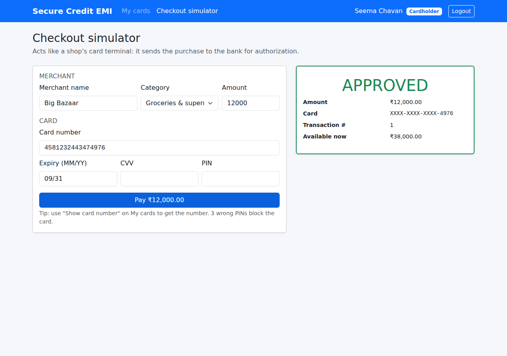
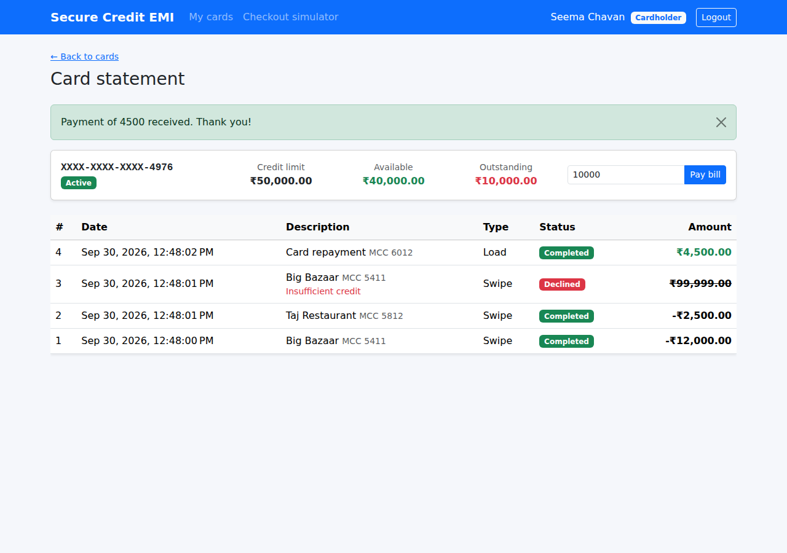
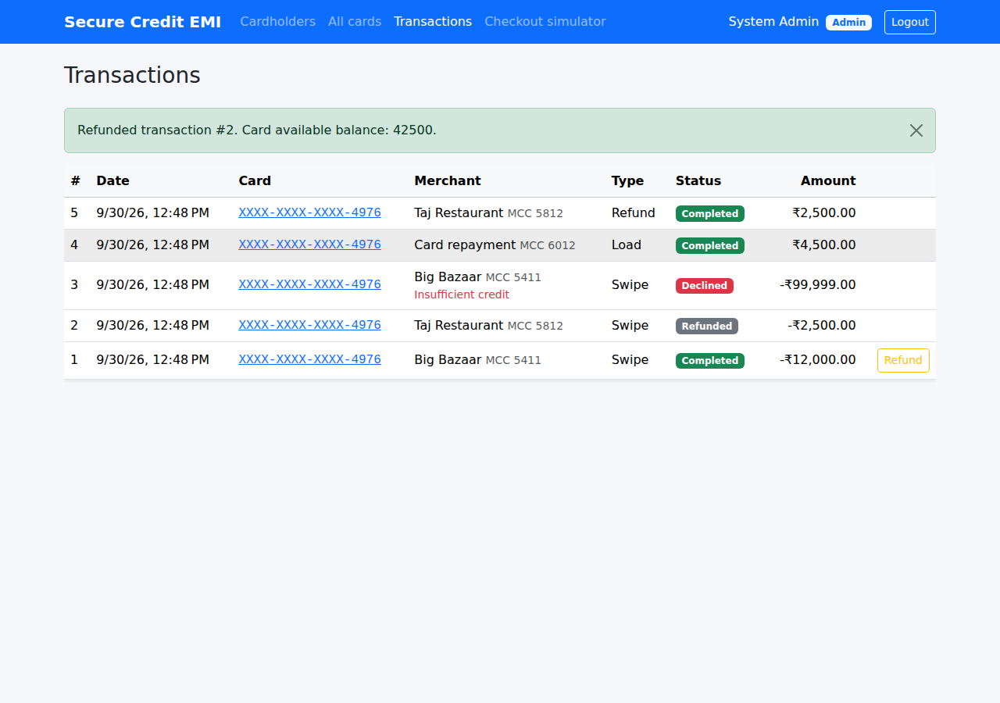

# Module 2 – Merchant Swipe & Load Operations

**Goal of this module** (spec §1):

> *Merchant Swipe & Load Operations: real-time card transaction swiping across merchants, balance
> loads, authorization checks, and transaction ledgering.*

At the end of this module:

- a **checkout simulator** acts like a shop's card terminal and sends purchases for **authorization**,
- every purchase is **approved or declined** (blocked card, expired card, wrong CVV, wrong PIN, not enough credit),
- **3 wrong PINs block the card** (in the checkout, *Change PIN* and *Show card number*),
- the customer can **pay the bill** (balance load) from the card statement,
- the bank (Admin) can **refund** a purchase,
- every movement is written to the **`Transactions` ledger** and shown as a paged **card statement**,
- two purchases hitting the same card at the same moment can **never overspend** the limit.

| Checkout simulator | Card statement + Pay bill |
|---|---|
|  |  |

| Admin: all transactions and refunds |
|---|
|  |

---

## Contents

1. [Before you start: update your local copy](#step-1--update-your-local-copy)
2. [Database changes](#step-2--database-changes)
3. [Domain layer – money rules and the ledger entity](#step-3--domain-layer)
4. [Finding a card from its number: the blind index](#step-4--finding-a-card-from-its-number-the-blind-index)
5. [The swipe authorization flow](#step-5--the-swipe-authorization-flow)
6. [PIN lockout (3 strikes)](#step-6--pin-lockout-3-strikes)
7. [Loads (repayments) and refunds](#step-7--loads-repayments-and-refunds)
8. [Concurrency: two swipes at the same time](#step-8--concurrency-two-swipes-at-the-same-time)
9. [API endpoints](#step-9--api-endpoints)
10. [Angular pages](#step-10--angular-pages)
11. [Tests](#step-11--tests)
12. [Run it and try it](#step-12--run-it-and-try-it)
13. [What comes next](#whats-next--module-3)

---

## Step 1 – Update your local copy

In `C:\My Projects\SecureCreditCardApp`:

```powershell
git pull
```

Your edited `appsettings.Development.json` (connection string) is **not** touched by Module 2, so
the pull won't conflict with it.

> If `git pull` complains about local changes in another file, run `git stash`, then `git pull`,
> then `git stash pop`.

---

## Step 2 – Database changes

File: [`database/02_Module2_Transactions.sql`](../database/02_Module2_Transactions.sql). Run it
**before** starting the API. In SSMS, open the file and press **Execute**, or:

```powershell
sqlcmd -S MANGESH-GHULE\SQLEXPRESS -E -i database\02_Module2_Transactions.sql
```

What it does:

| Change | Why |
|---|---|
| `CreditCards.CardNumberHash NVARCHAR(64) NULL` + unique filtered index | Find a card from the number a merchant sends (Step 4) |
| `CreditCards.FailedPinAttempts INT NOT NULL DEFAULT 0` | 3-strikes PIN lockout (Step 6) |
| drop `CK_CreditCards_Balance_Within_Limit` | allow a *credit balance* after a refund (Step 7) |
| `CREATE TABLE Transactions` (spec script 01b) + `IX_Transactions_CardId_Date` | the ledger |
| `Transactions.DeclineReason NVARCHAR(100) NULL` (not in the spec) | show *why* a swipe was declined |
| `CHECK` on `TransactionType` (`Swipe`, `Load`, `Refund`) and `TransactionStatus` (`Completed`, `Declined`, `Refunded`) | the database rejects invalid values |

> ⚠️ If you start the API **without** running this script, you'll get
> `Invalid column name 'CardNumberHash'`. Run the script and start again.

Cards issued in Module 1 have `CardNumberHash = NULL`. On start-up, `DbInitializer` decrypts each of
those numbers once, computes the hash and saves it, so your existing cards work in the checkout.
The log line is `Back-filled the card number lookup hash for N card(s)`.

---

## Step 3 – Domain layer

### 3.1 New enums and the ledger entity

`Domain/Enums/TransactionType.cs`, `TransactionStatus.cs` and `Domain/Entities/CardTransaction.cs`.
The class is called `CardTransaction` so it isn't confused with a *database* transaction; it maps to
the `Transactions` table.

Ledger rows are **never edited or deleted**, which is the basic accounting rule. They are created
only through factory methods, which makes the valid combinations explicit:

```csharp
CardTransaction.ApprovedSwipe(cardId, merchant, mcc, amount)          // Swipe  / Completed
CardTransaction.DeclinedSwipe(cardId, merchant, mcc, amount, reason)  // Swipe  / Declined
CardTransaction.Load(cardId, amount)                                  // Load   / Completed (MCC 6012)
original.Refund()   // original: Completed → Refunded, returns a new Refund / Completed row
```

`Refund()` enforces: only swipes, only `Completed` ones (so each purchase is refunded at most once),
and never a transaction converted to EMI (Module 4).

### 3.2 Money rules on `CreditCard`

```csharp
public string? GetSwipeDeclineReason(decimal amount)   // null = OK, otherwise the reason
{
    if (CardStatus == CardStatus.Blocked) return DeclineReasons.CardBlocked;
    if (IsExpired) return DeclineReasons.CardExpired;
    if (amount > AvailableBalance) return DeclineReasons.InsufficientCredit;
    return null;
}

public void Debit(decimal amount)        // purchase: AvailableBalance -= amount (rules above)
public void Credit(decimal amount)       // repayment: amount must be <= OutstandingAmount
public void CreditRefund(decimal amount) // refund: always accepted (may create a credit balance)
```

Remember from Module 1: `OutstandingAmount = CreditLimit - AvailableBalance`. Example with a limit
of 50,000:

| Action | Available | Outstanding |
|---|---|---|
| new card | 50,000 | 0 |
| swipe 12,000 | 38,000 | 12,000 |
| swipe 2,500 | 35,500 | 14,500 |
| pay bill 4,500 | 40,000 | 10,000 |
| refund the 2,500 | 42,500 | 7,500 |

### 3.3 Decline reasons are deliberately vague

`Domain/Common/DeclineReasons.cs`. An unknown card number, a wrong expiry date and a wrong CVV all
return the same **"Invalid card details"**. If each had its own message, a fraudster holding stolen
card data could learn which part is wrong and fix it one field at a time.

---

## Step 4 – Finding a card from its number: the blind index

**The problem.** A merchant sends `4581 2324 4347 4976`. We need the matching `CreditCards` row, but
the number is stored with AES-GCM and a **random nonce**, so encrypting the same number twice gives two
different cipher texts. `WHERE CardNumberEncrypted = ...` can never match. Decrypting every row on
every swipe would be far too slow.

**The solution: a blind index.** Next to the cipher text we store a keyed hash of the number:

```
CardNumberHash = HMAC-SHA256(lookupKey, "4581232443474976")   →  "9F2C…" (64 hex chars)
```

It is **deterministic** (same number → same hash), so it can be indexed and searched. Because it is
**keyed**, it can't be reversed without the key. A plain SHA-256 would *not* be safe here: our cards
share the BIN `458123` and only ~10⁹ numbers are possible, which an attacker could hash in minutes.

`Infrastructure/Security/HmacCardLookupHasher.cs`:

```csharp
// Derive a separate key from the master secret (key separation) – no new config value needed.
_key = HKDF.DeriveKey(HashAlgorithmName.SHA256, masterKey, outputLength: 32,
                      info: Encoding.UTF8.GetBytes("SecureEmiCard.CardNumberLookup.v1"));

public string Compute(string cardNumber) =>
    Convert.ToHexString(HMACSHA256.HashData(_key, Encoding.UTF8.GetBytes(cardNumber)));
```

**HKDF** derives an independent key from `Encryption:SecretPepper` using a unique label, so one master
secret can safely feed several purposes: the PIN pepper and the lookup key are cryptographically
unrelated.

A bonus: at issuance, `CardService` now regenerates the number if its hash already exists, so two
cards can never get the same number. The unique index enforces this in the database too.

---

## Step 5 – The swipe authorization flow

`Application/Features/Transactions/TransactionService.cs → AuthorizeAsync`. The order of the checks
is part of the security design:

```
POST /api/transactions/swipe
  0. FluentValidation          16 digits + Luhn, expiry, CVV 3 digits, PIN 4 digits, MCC 4 digits, amount → else 400
  1. find card by blind index   not found / someone else's card (cardholder) → DECLINED "Invalid card details" (not recorded)
  2. expiry month/year + CVV    mismatch                → DECLINED "Invalid card details"     (recorded)
  3. card state                 blocked / expired       → DECLINED "Card blocked" / "Card expired"
  4. PIN (3 strikes)            wrong / 3rd wrong       → DECLINED "Incorrect PIN" / "PIN tries exceeded - card blocked"
  5. funds                      amount > available      → DECLINED "Insufficient credit"
  6. APPROVE                    card.Debit(amount) + ApprovedSwipe row, saved in ONE database transaction
```

Why this order:

- **State before PIN.** On a blocked card we don't even look at the PIN, so a blocked card can't be
  used to keep guessing.
- **PIN before funds.** Otherwise "Insufficient credit" would confirm to a thief that the stolen card
  data (number, expiry, CVV) is correct without them knowing the PIN.
- **Declines are recorded** in the ledger with `DeclineReason`. Customers see failed attempts on their
  statement, which is also the basis for fraud monitoring. Only declines for unknown/foreign cards
  are not recorded, because there is no card to attach them to.

**A decline is HTTP 200, not an error.** The request was processed correctly and the answer is "no".
The response says so:

```json
{ "approved": false, "status": "Declined", "declineReason": "Insufficient credit",
  "transactionId": 3, "maskedCardNumber": "XXXX-XXXX-XXXX-4976", "amount": 99999, "availableBalance": null }
```

**Who may swipe.** In production the request comes from the merchant's bank (Module 5 adds signed,
encrypted inter-bank payloads). In this simulator a **Cardholder** can only use **their own** cards,
and an **Admin** acts as the merchant terminal and can use any card. The endpoint is rate limited like
login.

---

## Step 6 – PIN lockout (3 strikes)

`Application/Features/Cards/PinCheck.cs` is used by **every** PIN check: swipe, *Change PIN*, *Show
card number*.

```csharp
public static PinCheckResult Verify(ISecretHasher hasher, CreditCard card, string pin)
{
    if (hasher.Verify(pin, card.PinHash))
    {
        if (card.FailedPinAttempts > 0) card.ResetFailedPinAttempts();  // a correct PIN resets the counter
        return PinCheckResult.Valid;
    }
    card.RegisterFailedPinAttempt();                  // 3rd failure → CardStatus = Blocked
    return card.IsActive ? PinCheckResult.Invalid : PinCheckResult.LockedOut;
}
```

The important detail is **saving before throwing**. In `CardService.VerifyPinOrThrowAsync` the
counter is saved to the database *before* the 401 is returned. If we threw first, the change would be
thrown away with the request, and an attacker could guess all 10,000 PINs one request at a time.

The customer sees *"Incorrect PIN. 2 attempt(s) left before the card is blocked."*. When an Admin
unblocks the card (**All cards → Unblock**), the counter goes back to 0.

---

## Step 7 – Loads (repayments) and refunds

**Load / Pay bill** (`POST /api/transactions/load`, owner or Admin):

- `card.Credit(amount)`: the amount must be ≤ what is owed. You can't overpay a credit card here.
- Works on **blocked** cards: a customer must always be able to repay.
- Ledger row: *"Card repayment"*, MCC `6012` (financial institutions).

**Refund** (`POST /api/transactions/{id}/refund`, Admin only):

- `original.Refund()` marks the purchase `Refunded` and creates a `Refund` row.
- `card.CreditRefund(amount)` gives the money back, **always**.

**Credit balance.** Suppose a customer buys for 300, pays the 300 bill, and the shop then refunds the
300. The bank now owes the customer 300: `AvailableBalance` = limit + 300 and `OutstandingAmount` =
-300. That's why script 02 drops the Module 1 constraint `AvailableBalance <= CreditLimit`. The
Angular pages show this as **"Credit balance"** instead of "Outstanding".

---

## Step 8 – Concurrency: two swipes at the same time

**The race.** A card has 1,000 available. Two terminals send 800 at the same millisecond:

```
Request A: read card (1,000)            Request B: read card (1,000)
Request A: 1,000 ≥ 800 → OK             Request B: 1,000 ≥ 800 → OK
Request A: save available = 200         Request B: save available = 200   ← 1,600 spent on a 1,000 limit!
```

**The fix: optimistic concurrency.** In `CreditCardConfiguration`:

```csharp
b.Property(x => x.AvailableBalance).HasPrecision(18, 2).IsConcurrencyToken();
```

EF Core now writes every update as

```sql
UPDATE CreditCards SET AvailableBalance = 200 WHERE CardId = 1 AND AvailableBalance = 1000;
```

Request A updates 1 row. Request B's `WHERE AvailableBalance = 1000` no longer matches, so it updates
0 rows, and EF throws `DbUpdateConcurrencyException`. Nothing is overspent.

The layers handle it like this:

1. `AppDbContext.SaveChangesAsync` converts EF's exception into the application's own
   `ConcurrencyConflictException`, so the Application layer stays free of EF.
2. `TransactionService.WithConcurrencyRetryAsync` clears the stale data (`IUnitOfWork.ClearChanges()`)
   and **runs the whole authorization again** with fresh data, up to 3 times. Request B now sees 200
   available and is declined with *Insufficient credit*.
3. If all retries fail, the API returns **409 Conflict**.

The balance update and the ledger insert are saved by **one** `SaveChangesAsync`, which is one SQL
transaction. You can never get a debit without its ledger row, or the reverse.

> Why "optimistic"? We don't lock the row while working. We just detect a conflict at save time. It's
> fast when conflicts are rare, which is the case for a single card.

---

## Step 9 – API endpoints

| Method | Route | Role | Purpose |
|---|---|---|---|
| POST | `/api/transactions/swipe` | Cardholder (own cards) / Admin | Authorize a purchase → `SwipeResponse` |
| POST | `/api/transactions/load` | owner / Admin | Pay bill `{cardId, amount}` |
| POST | `/api/transactions/{id}/refund` | Admin | Full refund of a completed swipe |
| GET | `/api/transactions/card/{cardId}?page=1&pageSize=20` | owner / Admin | Card statement (newest first) |
| GET | `/api/transactions?page=1&pageSize=20` | Admin | All transactions |
| GET | `/api/transactions/merchant-categories` | any | MCC list for the checkout drop-down |

Paged responses look like:

```json
{ "items": [ ... ], "page": 1, "pageSize": 20, "totalCount": 57, "totalPages": 3 }
```

`pageSize` is capped at 100 so nobody can ask for a million rows at once.

Example swipe body (Swagger → `POST /api/transactions/swipe` → *Try it out*):

```json
{
  "cardNumber": "4581232443474976",
  "expiryMonth": 9,
  "expiryYear": 2031,
  "cvv": "577",
  "pin": "2580",
  "merchantName": "Big Bazaar",
  "merchantCategoryCode": "5411",
  "amount": 1200
}
```

---

## Step 10 – Angular pages

New files:

```
core/models/transaction.models.ts          SwipeRequest/Response, Transaction, PagedResult<T>, MerchantCategory
core/services/transaction.service.ts       swipe, load, refund, getForCard, getAll, getMerchantCategories
features/transactions/checkout/            Checkout simulator            route /pay
features/transactions/card-transactions/   Card statement + Pay bill     route /cards/:cardId/transactions
features/admin/all-transactions/           All transactions + Refund     route /admin/transactions
features/transactions/transaction-badges.ts  shared helpers (badge colour, +/- amount)
```

Worth noticing:

- **Route parameter as a signal input.** `readonly cardId = input.required<string>();` works because
  `app.config.ts` enables `withComponentInputBinding()`: the router puts `:cardId` straight into the input.
- **Secrets don't stay in the form.** After each authorization the checkout clears the CVV and PIN
  fields. The form also uses `autocomplete="off"` and `type="password"` for them.
- **Signed amounts.** Swipes show as `-₹12,000.00`, loads and refunds as positive green amounts, and
  declined swipes are struck through.
- **Navigation.** Cardholders get *My cards* and *Checkout simulator*; Admins also get *Transactions*.
  *My cards* and *All cards* link to each card's statement.

---

## Step 11 – Tests

```powershell
cd backend
dotnet test
```

45 tests (Module 1's 27 + 18 new):

| Test class | What it proves |
|---|---|
| `CardMoneyRulesTests` | debit/credit maths, no overspend or overpay, blocked card can be repaid, 3 PINs block, refund once only |
| `TransactionServiceTests` | approved swipe writes the ledger; insufficient credit declined and not debited; wrong CVV/expiry give the same reason; 3 wrong PINs block (swipe and reveal); a correct PIN resets the counter; can't use someone else's card; load can't exceed what's owed; refund is Admin-only and happens once; paging is newest first and private |
| `Concurrent_update_of_the_same_card_is_detected` | two DbContexts spend 800 of 1,000 at once: the first saves, the second gets `ConcurrencyConflictException`, and 200 remains |
| `RefundAfterRepaymentTests` | refund after full repayment creates a credit balance |
| `CardLookupHasherTests` | the blind index is deterministic, 64 hex chars, doesn't contain the number, and depends on the secret key |

---

## Step 12 – Run it and try it

```powershell
# 1. database (once)
sqlcmd -S MANGESH-GHULE\SQLEXPRESS -E -i database\02_Module2_Transactions.sql

# 2. API
cd backend
dotnet run --project src\SecureEmiCard.Api --launch-profile http

# 3. Angular (second terminal)
cd frontend
npm start
```

Walk-through:

1. Log in as your customer → **My cards** → **Show card number** (enter the PIN) and note the number
   and expiry. (The CVV is the one shown when the card was issued. If you didn't keep it, issue a new
   card as Admin.)
2. **Checkout simulator** → pay 12,000 at *Big Bazaar* → **APPROVED**.
3. Pay 99,999 → **DECLINED – Insufficient credit**.
4. **My cards → Statement / Pay bill** → you see both rows (the declined one struck through) → pay 4,500.
5. Log in as Admin → **Transactions** → **Refund** the 12,000 purchase.
6. As the customer, enter a wrong PIN 3 times in the checkout → the third answer is *PIN tries exceeded
   - card blocked*. As Admin → **All cards → Unblock**.
7. In SSMS:

   ```sql
   SELECT TransactionId, CardId, MerchantName, Amount, TransactionType, TransactionStatus, DeclineReason
   FROM dbo.Transactions ORDER BY TransactionId DESC;

   SELECT CardId, MaskedCardNumber, CardNumberHash, AvailableBalance, FailedPinAttempts, CardStatus
   FROM dbo.CreditCards;
   ```

---

## What's next – Module 3

[Module 3 guide →](03-Module-3-Cashback.md)

**Automated Cashback Reward Engine:** a `CashbackLogs` table and a rules engine by Merchant Category
Code (groceries 5411 → 3 %, dining 5812 → 3 %, fuel 5541 → 2 %, everything else 1 %). Cashback is
calculated for every **approved** swipe in the same database transaction, reversed when a purchase is
refunded, and shown to the customer as a cashback history and total.
