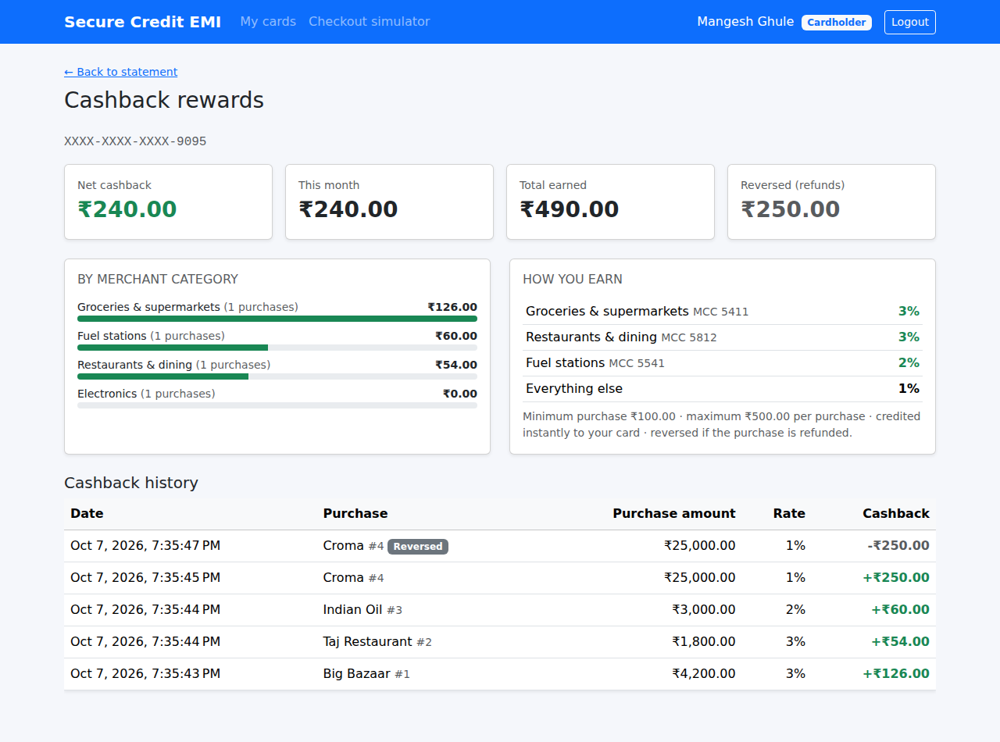
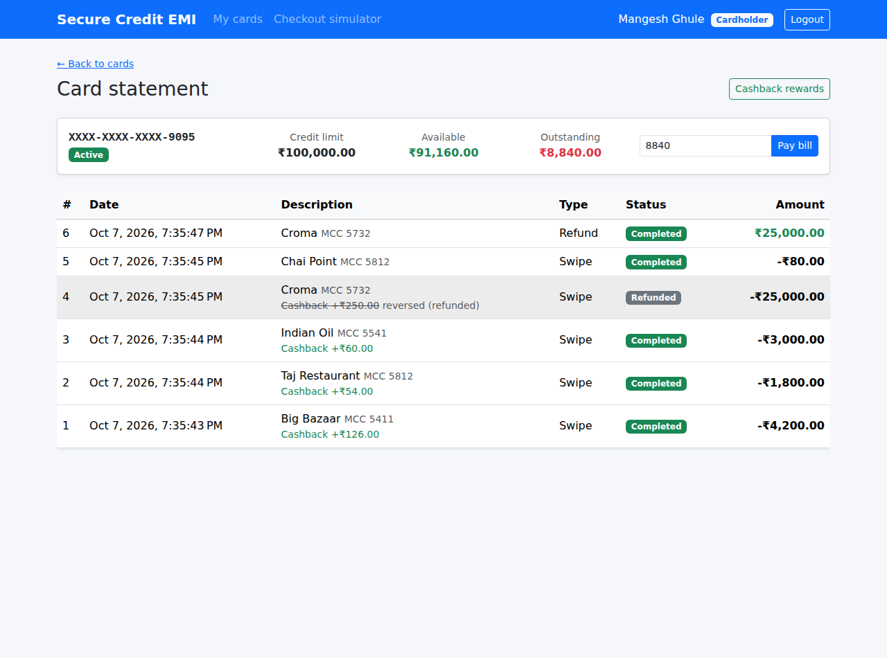

# Module 3 – Automated Cashback Reward Engine

**Goal of this module** (spec §1 and §4B):

> *Automated Cashback Reward Engine: configurable percentage-based reward calculation on every swiped
> transaction based on merchant category and spent amount.*

At the end of this module:

- every **approved** swipe automatically earns cashback, based on the **merchant category** and the **amount**,
- the cashback is credited to the card **instantly** as a statement credit, which lowers what the customer owes,
- a **refund automatically takes back** the cashback of that purchase,
- the customer sees cashback on the **checkout result**, on each **statement row**, and on a new
  **Cashback rewards** page (totals, this month, per category, rules, history),
- the rules can be **changed in configuration** without changing code.

| Cashback rewards page | Statement with cashback per purchase |
|---|---|
|  |  |

---

## Contents

1. [Update your local copy and the database](#step-1--update-your-local-copy-and-the-database)
2. [The rules](#step-2--the-rules)
3. [Domain layer – the cashback ledger](#step-3--domain-layer)
4. [The cashback engine](#step-4--the-cashback-engine)
5. [Earning cashback inside the swipe](#step-5--earning-cashback-inside-the-swipe)
6. [Reversing cashback on refund](#step-6--reversing-cashback-on-refund)
7. [Reports: totals and per-category breakdown](#step-7--reports)
8. [Changing the rules in configuration](#step-8--changing-the-rules-in-configuration)
9. [API endpoints](#step-9--api-endpoints)
10. [Angular](#step-10--angular)
11. [Tests](#step-11--tests)
12. [Run it and try it](#step-12--run-it-and-try-it)
13. [What comes next](#whats-next--module-4)

---

## Step 1 – Update your local copy and the database

```powershell
cd "C:\My Projects\SecureCreditCardApp"
git pull

# BEFORE starting the API:
sqlcmd -S MANGESH-GHULE\SQLEXPRESS -E -i database\03_Module3_Cashback.sql
```

Or open `database\03_Module3_Cashback.sql` in SSMS and press **Execute**. Starting the API without
this script gives `Invalid object name 'CashbackLogs'`.

`appsettings.json` and `appsettings.Development.json` are **not** changed by this module, so your
connection string stays as it is.

The script creates `CashbackLogs` (spec script 01c) with a few additions:

| Column / constraint | Why |
|---|---|
| `CashbackType` = `Earned` / `Reversed` (not in the spec) | a refund adds a reversal row instead of deleting anything |
| `CHECK`: Earned → amount > 0, Reversed → amount < 0 | the sign always matches the type |
| `UNIQUE (TransactionId, CashbackType)` | a purchase earns cashback **at most once** and is reversed **at most once**, even if a bug or a double click tries again |
| `FK_CashbackLogs_CreditCards` (the spec only had the FK to `Transactions`) | `CardId` can never point to a card that doesn't exist |
| index `(CardId, CreditedDate DESC)` | fast "my cashback, newest first" |

> Purchases you made in Module 2 earned no cashback (the engine didn't exist yet). Only new
> purchases earn cashback.

---

## Step 2 – The rules

From the specification's `CalculateTransactionCashback`:

| Merchant category (MCC) | Cashback |
|---|---|
| 5411 Groceries & supermarkets | 3 % |
| 5812 Restaurants & dining | 3 % |
| 5541 Fuel stations | 2 % |
| everything else | 1 % |

The spec asks for rules based on the merchant category **and the spent amount**, so two amount rules
are added:

| Rule | Default |
|---|---|
| Minimum purchase to earn cashback | ₹100 |
| Maximum cashback per purchase | ₹500 |

Examples: groceries ₹4,200 → ₹126 · fuel ₹3,000 → ₹60 · electronics ₹25,000 → ₹250 · dining ₹80 → ₹0
(below the minimum) · groceries ₹50,000 → ₹500 (capped; 3 % would be ₹1,500).

**Where does the cashback go?** It's a **statement credit**: `AvailableBalance` goes up, so the
customer owes less. The spec's `CreditedDate` column says it is *credited*, and this is the simplest
model to understand. (Many real cards instead collect points and let you redeem them later.)

---

## Step 3 – Domain layer

`Domain/Entities/CashbackLog.cs` is a **ledger**, like `Transactions`: rows are only ever inserted.

```csharp
CashbackLog.Earned(swipe, percentage: 3m, amount: 126m)   // CashbackType.Earned,   +126
earned.CreateReversal()                                   // CashbackType.Reversed, -126
```

- `Earned(...)` only accepts an **approved swipe**. A declined swipe or a repayment can't earn cashback.
- A reversal is stored as a **negative** amount, so `SUM(CashbackAmount)` is always the net cashback.
  No `CASE WHEN` is needed in any report.
- A reversal keeps the **original swipe's** `TransactionId`. Together with the unique constraint, this
  makes a second reversal impossible.

Two new methods on `CreditCard`:

```csharp
public void CreditReward(decimal amount)   // AvailableBalance += amount (always allowed, like a refund)
public void ReverseReward(decimal amount)  // AvailableBalance -= amount
```

**Why does `Earned` take the transaction object and not its id?** The swipe and its cashback are
saved in the **same** `SaveChanges`. Before that save, the swipe has no `TransactionId` yet (SQL
Server assigns it on INSERT). Passing the object lets EF Core insert the swipe first, read the new id,
and put it into `CashbackLogs.TransactionId` automatically.

---

## Step 4 – The cashback engine

`Application/Features/Cashback/CashbackEngine.cs` replaces the spec's
`EmiEngineService.CalculateTransactionCashback` with its own class:

```csharp
public CashbackQuote Calculate(decimal amount, string merchantCategoryCode)
{
    if (amount < Rules.MinimumSpend) return CashbackQuote.None;

    var percentage = Rules.CategoryPercentages.TryGetValue(merchantCategoryCode, out var p)
        ? p : Rules.DefaultPercentage;
    if (percentage <= 0) return CashbackQuote.None;

    var cashback = Math.Round(amount * percentage / 100m, 2, MidpointRounding.AwayFromZero);
    cashback = Math.Min(cashback, Rules.MaxCashbackPerTransaction);
    return cashback > 0 ? new CashbackQuote(percentage, cashback) : CashbackQuote.None;
}
```

Design notes:

- **Single responsibility.** In the spec, EMI and cashback maths shared one class. Separate classes
  are easier to test and to change independently. Module 4 adds its own EMI engine.
- **Pure function.** It has no database, no clock and no current user, so its tests are one-liners.
- **`decimal`, never `double`, for money.** `0.1 + 0.2` is `0.30000000000000004` in `double` but
  exactly `0.3` in `decimal`.
- **Rounding.** .NET's default `Math.Round` is *banker's rounding* (1.005 → 1.00). Customers expect
  1.005 → 1.01, so we use `MidpointRounding.AwayFromZero`.

---

## Step 5 – Earning cashback inside the swipe

`TransactionService.AuthorizeAsync` now has a step 7:

```csharp
// 6. Approve
card.Debit(r.Amount);
var txn = CardTransaction.ApprovedSwipe(card.CardId, r.MerchantName, r.MerchantCategoryCode, r.Amount);
await _transactions.AddAsync(txn, ct);

// 7. Cashback
var cashback = _cashbackEngine.Calculate(r.Amount, r.MerchantCategoryCode);
if (cashback.Amount > 0)
{
    card.CreditReward(cashback.Amount);
    await _cashback.AddAsync(CashbackLog.Earned(txn, cashback.Percentage, cashback.Amount), ct);
}

await _unitOfWork.SaveChangesAsync(ct);   // swipe + balance + cashback: ONE database transaction
```

**Atomicity.** The debit, the ledger row and the cashback are written by one `SaveChangesAsync`, which
is one SQL transaction. If anything fails, none of it is saved. You can never have a purchase without
its cashback, or cashback without a purchase.

**Concurrency** still works as in Module 2: the card's `AvailableBalance` is the concurrency token,
and a retry re-runs the whole authorization, cashback included.

Only **approved** swipes reach step 7. Declined swipes, wrong PINs and repayments never earn cashback.

The swipe response now includes `cashbackAmount` and `cashbackPercentage`, and `availableBalance`
already includes the cashback.

---

## Step 6 – Reversing cashback on refund

In `TransactionService.RefundAsync`:

```csharp
var refund = original.Refund();
card.CreditRefund(original.Amount);          // 1. give the purchase amount back
await _transactions.AddAsync(refund, ct);

var logs = await _cashback.GetByTransactionIdsAsync(new[] { original.TransactionId }, ct);
var earned = logs.FirstOrDefault(l => l.CashbackType == CashbackType.Earned);
if (earned is not null && logs.All(l => l.CashbackType != CashbackType.Reversed))
{
    card.ReverseReward(earned.CashbackAmount);           // 2. take the cashback back
    await _cashback.AddAsync(earned.CreateReversal(), ct);
}
await _unitOfWork.SaveChangesAsync(ct);                  // all in one transaction
```

Why this order: the refund is credited **first** and is always larger than its cashback, so taking the
cashback back can never push `AvailableBalance` below 0.

Example from the screenshots: Croma ₹25,000 earned ₹250 (1 %). After the refund the customer got
₹25,000 back and lost the ₹250. The statement shows the cashback crossed out as *reversed (refunded)*,
and the rewards history shows `-₹250.00 Reversed`.

---

## Step 7 – Reports

`CashbackRepository.GetTotalsAsync` lets **SQL Server do the maths**. Loading every row and adding
them up in C# would be slow for a card with years of history. The per-category query EF Core generates:

```sql
SELECT t.MerchantCategoryCode AS Mcc,
       COALESCE(SUM(c.CashbackAmount), 0.0) AS Net,
       COUNT(CASE WHEN c.CashbackType = N'Earned' THEN 1 END) AS [Count]
FROM CashbackLogs c
INNER JOIN Transactions t ON c.TransactionId = t.TransactionId
WHERE c.CardId = @cardId
GROUP BY t.MerchantCategoryCode
```

The summary returns **net**, **earned**, **reversed**, **this month** and **per category**.

On the statement, each swipe row shows its cashback. `TransactionService` loads the cashback for the
**whole page in one query** (`WHERE TransactionId IN (...)`), not one query per row. Doing it row by
row is the classic "N+1 queries" performance bug.

---

## Step 8 – Changing the rules in configuration

The defaults are in `CashbackOptions.cs`. To change them, add a `"Cashback"` section to
`backend\src\SecureEmiCard.Api\appsettings.Development.json` (or to environment variables / Key Vault
in production):

```json
"Cashback": {
  "DefaultPercentage": 1.0,
  "MinimumSpend": 100,
  "MaxCashbackPerTransaction": 500,
  "CategoryPercentages": {
    "5732": 5.0,
    "5541": 0
  }
}
```

This example adds a 5 % electronics promotion and switches fuel cashback off (0 %). Entries in
`CategoryPercentages` are **merged** with the defaults, so groceries and dining stay at 3 %. Restart
the API to apply them. The **How you earn** box on the rewards page shows the active rules.

Invalid values (a percentage outside 0–100, an MCC that isn't 4 digits, a cap ≤ 0) stop the API at
start-up with a clear message (`ValidateOnStart`), rather than paying out wrong cashback.

The percentage used is **stored in every `CashbackLogs` row**. If you change the rules later, old rows
still show the rate that was actually paid.

---

## Step 9 – API endpoints

| Method | Route | Role | Purpose |
|---|---|---|---|
| GET | `/api/cashback/rules` | any | Active rules |
| GET | `/api/cashback/card/{cardId}/summary` | owner / Admin | Net, earned, reversed, this month, per category |
| GET | `/api/cashback/card/{cardId}?page=1&pageSize=20` | owner / Admin | Cashback ledger, newest first |

Changed:

- `POST /api/transactions/swipe` → the response has `cashbackAmount` and `cashbackPercentage`
- `GET /api/transactions/card/{id}` → each row has `cashbackEarned` and `cashbackReversed`

---

## Step 10 – Angular

New:

```
core/models/cashback.models.ts
core/services/cashback.service.ts
features/cashback/card-rewards/      route /cards/:cardId/rewards
```

Changed:

- **Checkout result:** a green *Cashback (3%) +₹126.00* line.
- **Statement:** *Cashback +₹60.00* under each purchase, or crossed out with *reversed (refunded)*, plus
  a **Cashback rewards** button.
- **My cards / All cards:** a **Rewards** button per card.

The rewards page shows four tiles, a bar per merchant category (pure Bootstrap `progress` bars, no
chart library needed), the **How you earn** rules from the API, and the paged history.

---

## Step 11 – Tests

```powershell
cd backend
dotnet test
```

63 tests (45 from Modules 1–2 + 18 new):

| Test class | What it proves |
|---|---|
| `CashbackEngineTests` | 3/3/2/1 % by MCC, unknown MCC → 1 %, minimum spend, ₹500 cap, AwayFromZero rounding, rules from configuration |
| `CashbackFlowTests` | approved swipe earns cashback and the FK is filled in; declined, small or wrong-PIN swipes earn nothing; refund reverses exactly once and restores the balance; summary nets reversals and groups by category; statement rows show earned/reversed; another customer can't see your cashback; rules are ordered |
| `CashbackLogTests` | only approved swipes earn; reversal is negative; a reversal can't be reversed; reward credit/reversal on the card |
| updated Module 2 tests | balances now include cashback (e.g. a ₹250 grocery swipe leaves ₹757.50, not ₹750) |

---

## Step 12 – Run it and try it

1. `git pull` → run `03_Module3_Cashback.sql` → start the API → `npm start`.
2. As your customer, in the **Checkout simulator**:
   - Groceries ₹4,200 → *Cashback (3%) +₹126.00*
   - Restaurants ₹1,800 → +₹54
   - Fuel ₹3,000 → +₹60
   - Electronics ₹25,000 → +₹250 (1 %)
   - Restaurants ₹80 → no cashback (below ₹100)
3. **My cards → Rewards**: net ₹490, with the per-category bars.
4. As Admin, go to **Transactions** and **Refund** the electronics purchase. Back as the customer, the
   rewards page shows earned ₹490, reversed ₹250 and net ₹240.
5. In SSMS:

   ```sql
   SELECT c.CashbackId, c.TransactionId, t.MerchantName, t.MerchantCategoryCode, t.Amount,
          c.CashbackPercentage, c.CashbackAmount, c.CashbackType, c.CreditedDate
   FROM dbo.CashbackLogs c JOIN dbo.Transactions t ON t.TransactionId = c.TransactionId
   ORDER BY c.CashbackId;

   SELECT CardId, SUM(CashbackAmount) AS NetCashback FROM dbo.CashbackLogs GROUP BY CardId;
   ```

---

## What's next – Module 4

[Module 4 guide →](04-Module-4-Emi.md)

**EMI Conversion Engine:** the `EmiPlans` and `EmiSchedules` tables, an EMI **preview calculator**
(the reducing-balance formula `EMI = P·r·(1+r)ⁿ / ((1+r)ⁿ − 1)`), converting an eligible purchase
(above ₹100, not refunded, not already converted) into a 3/6/12/24-month plan, the full amortization
schedule (principal and interest per month), and paying installments.
