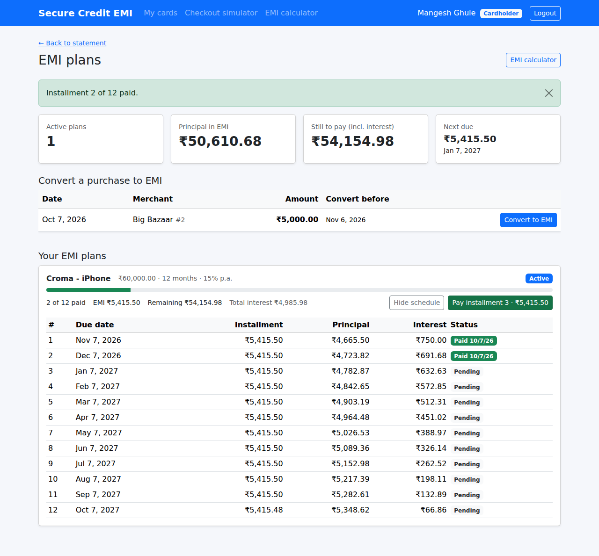
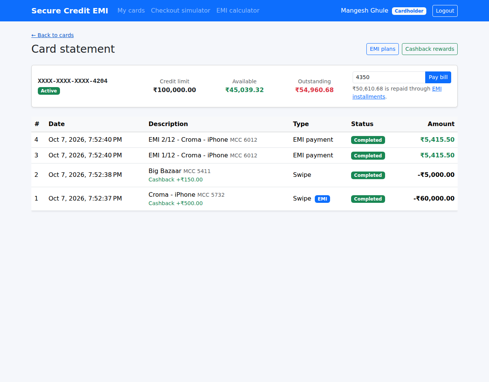
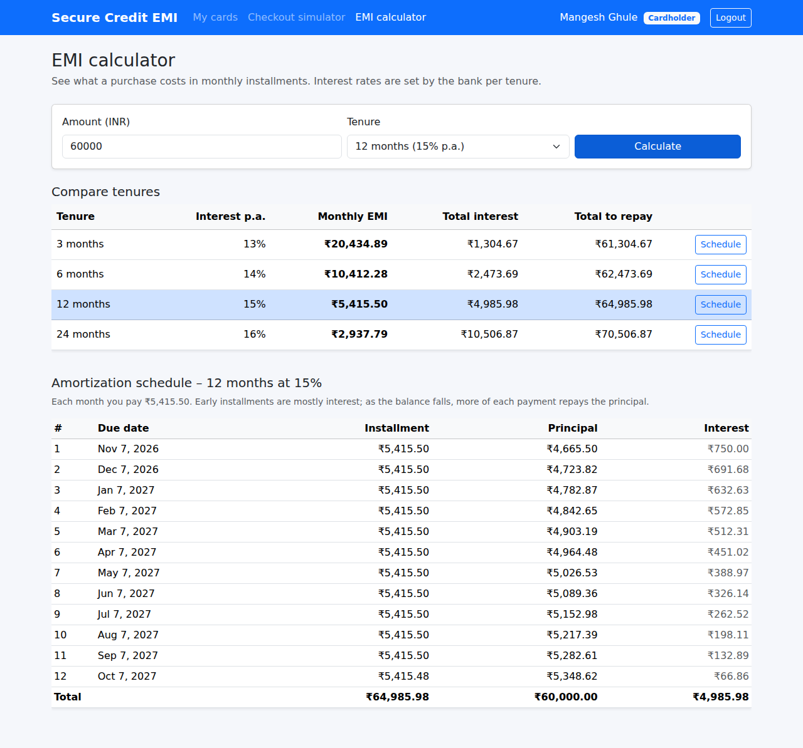

# Module 4 – EMI Conversion Engine

**Goal of this module** (spec §1, §4B, §4C, §5):

> *EMI Conversion Engine: flexible conversion of eligible posted transactions into fixed-rate Equated
> Monthly Installment (EMI) plans across variable tenures (3, 6, 12, 24 months) with automated repayment
> schedules.*

At the end of this module:

- an **EMI calculator** compares 3/6/12/24-month options and shows the full **amortization schedule**,
- a customer can **convert an eligible purchase** into an EMI plan,
- each plan has a schedule of monthly installments (**principal + interest**) with due dates,
- installments are **paid in order**; each payment frees its principal part of the credit limit,
- the plan **closes** after the last installment,
- *Pay bill* no longer accepts the part of the bill that is being repaid in EMIs.

| EMI plan with amortization schedule | Statement: EMI badge and EMI payments |
|---|---|
|  |  |

| EMI calculator |
|---|
|  |

---

## Contents

1. [Update your local copy and the database](#step-1--update-your-local-copy-and-the-database)
2. [EMI basics in 2 minutes](#step-2--emi-basics-in-2-minutes)
3. [The calculator: exact decimal amortization](#step-3--the-calculator)
4. [Who decides the interest rate?](#step-4--who-decides-the-interest-rate)
5. [Domain layer – the `EmiPlan` aggregate](#step-5--domain-layer)
6. [Eligibility and conversion](#step-6--eligibility-and-conversion)
7. [The money model: limit, installments and Pay bill](#step-7--the-money-model)
8. [Paying an installment safely](#step-8--paying-an-installment-safely)
9. [Concurrency: refund vs. conversion](#step-9--concurrency-refund-vs-conversion)
10. [API endpoints](#step-10--api-endpoints)
11. [Angular pages](#step-11--angular-pages)
12. [Tests](#step-12--tests)
13. [Run it and try it](#step-13--run-it-and-try-it)
14. [What comes next](#whats-next--module-5)

---

## Step 1 – Update your local copy and the database

```powershell
cd "C:\My Projects\SecureCreditCardApp"
git pull

# BEFORE starting the API:
sqlcmd -S MANGESH-GHULE\SQLEXPRESS -E -i database\04_Module4_Emi.sql
```

Or open `database\04_Module4_Emi.sql` in SSMS and press **Execute**. Without it, the API fails with
`Invalid object name 'EmiPlans'`.

What the script does:

| Change | Why |
|---|---|
| `CK_Transactions_Type` now also allows `EmiInstallment` | installment payments are written to the ledger |
| `EmiPlans` (spec script 01b) + FK to `CreditCards` + CHECKs | the plan; `TransactionId` is **UNIQUE**, so one plan per purchase |
| `EmiSchedules` (spec script 01c) + `PaymentTransactionId` | one row per month; a paid row points to its ledger payment |
| `UNIQUE (EmiPlanId, InstallmentNumber)` | no duplicate installment numbers |
| `CHECK (AmountDue = PrincipalComponent + InterestComponent)` | the parts always add up |
| `CHECK (PaymentStatus <> 'Paid' OR PaidDate IS NOT NULL)` | a paid installment always has a payment date |

The settings files are **not** changed by this module.

---

## Step 2 – EMI basics in 2 minutes

You buy a phone for **₹60,000** and convert it to **12 months at 15 % per year**:

- monthly rate `r` = 15 / 12 / 100 = **1.25 %**
- EMI = `P · r · (1+r)ⁿ / ((1+r)ⁿ − 1)` = **₹5,415.50** per month

Each month:

```
interest  = remaining principal × 1.25 %
principal = EMI − interest
remaining principal -= principal
```

| # | Installment | Principal | Interest | Principal left |
|---|---|---|---|---|
| 1 | 5,415.50 | 4,665.50 | 750.00 | 55,334.50 |
| 2 | 5,415.50 | 4,723.82 | 691.68 | 50,610.68 |
| … | … | … | … | … |
| 12 | **5,415.48** | 5,348.62 | 66.86 | 0.00 |

Two things to notice:

- Early installments are mostly **interest**; later ones are mostly **principal**. This is called a
  *reducing balance* loan.
- The **last installment is 2 paise less**. Every amount is rounded to 2 decimals, and the last month
  repays *exactly* what is left, so the principal parts add up to ₹60,000.00 to the paisa.

Total interest on this plan: ₹4,985.98.

---

## Step 3 – The calculator

`Application/Features/Emi/EmiCalculator.cs` is the spec's `EmiEngineService.CalculateEmiPlan`, fixed in
five ways:

| Spec code | Problem | Our version |
|---|---|---|
| `Math.Pow((double)(1 + r), n)` | `double` is binary floating point: `(1.0125)^12` is not exact, and the error ends up in money | `decimal` multiplication loop: `Pow(1 + r, n)` |
| `totalRepayable = EMI × n` | ignores the last-month adjustment | `Sum(schedule amounts)` |
| loop never fixes the remainder | principal parts can add up to ₹59,999.97 or ₹60,000.03 | last month: `principal = balance` |
| `r = 0` → divide by zero | 0 % promotional EMI crashes | `EMI = P / n` when `r = 0` |
| `currentDate.AddMonths(1)` each month | 31 Jan → 28 Feb → 28 Mar (drifts) | `startDate.AddMonths(month)` → 28 Feb, 31 Mar, 30 Apr |

Rounding is `MidpointRounding.AwayFromZero` (see Module 3). The tests check the result against the
figure every bank's EMI calculator shows: ₹1,00,000 at 15 % for 12 months → **₹9,025.83**.

---

## Step 4 – Who decides the interest rate?

In the spec, the client sends the rate:

```csharp
public record ConvertEmiDto(int TenureMonths, decimal InterestRate);   // spec – unsafe
```

Anyone with Swagger or Postman could send `"interestRate": 0` and get a free loan. **Never trust the
client with a price.** Here the request only carries the tenure:

```csharp
public record ConvertToEmiRequest(int TenureMonths);
```

and the bank's rates come from `EmiOptions` (`Application/Features/Emi/EmiOptions.cs`):

| Tenure | Interest p.a. (default) |
|---|---|
| 3 months | 13 % |
| 6 months | 14 % |
| 12 months | 15 % |
| 24 months | 16 % |

You can change them in `appsettings.Development.json`, like the cashback rules:

```json
"Emi": {
  "MinimumAmount": 100,
  "ConversionWindowDays": 30,
  "AnnualInterestRates": { "3": 0, "6": 12.5 }
}
```

This example makes 3 months a **0 % "no-cost EMI"** and 6 months 12.5 %. The entries are merged with the
defaults, so 12 and 24 months stay at 15 % and 16 %. Invalid values (a tenure other than 3/6/12/24, a
rate above 60 %) stop the API at start-up. The **rate is stored in every plan**, so changing the
configuration never changes existing plans.

---

## Step 5 – Domain layer

### 5.1 `EmiPlan` is an aggregate root

`Domain/Entities/EmiPlan.cs` owns its `EmiSchedule` rows (`Domain/Entities/EmiSchedule.cs`). Nobody
changes a schedule row directly: `EmiSchedule.MarkPaid` is `internal`, and the only way in is
`EmiPlan.PayInstallment`. That's how these rules can't be bypassed:

```csharp
public EmiSchedule PayInstallment(int installmentNumber, CardTransaction payment, DateTime paidAtUtc)
{
    if (PlanStatus == EmiPlanStatus.Closed)               throw ... "already closed"
    if (installment.IsPaid)                               throw ... "Installment N is already paid"
    if (NextInstallment.InstallmentNumber != installmentNumber) throw ... "Please pay installment K first"
    if (payment.Amount != installment.AmountDue)          throw ... "must equal the installment amount"

    installment.MarkPaid(payment, paidAtUtc);
    RemainingBalance -= installment.AmountDue;
    if (NextInstallment is null) PlanStatus = EmiPlanStatus.Closed;   // last one closes the plan
    return installment;
}
```

`EmiPlan.Create(...)` refuses a schedule whose principal parts don't add up to exactly the purchase
amount, or that doesn't have one line per month.

### 5.2 New rules on existing entities

- `CardTransaction.GetEmiIneligibilityReason(...)` and `MarkEmiConverted(...)` (Step 6).
- `CardTransaction.EmiInstallment(...)` creates the ledger row for a payment (type `EmiInstallment`,
  MCC 6012).
- `CreditCard.ReleaseEmiPrincipal(principal)` adds the paid principal back to the available balance.
- `CardTransaction.Refund()` already refused converted purchases (added in Module 2).

---

## Step 6 – Eligibility and conversion

A purchase can be converted when **all** of these hold:

| Rule | Source |
|---|---|
| it's a **Swipe** (not a Load, Refund or EMI payment) | spec |
| it was **approved** (`Completed`), not declined and not refunded | spec |
| it is **not already converted** | spec ("Not converted") |
| amount **more than ₹100** (`MinimumAmount`, configurable) | spec ("Amount > $100") |
| made in the **last 30 days** (`ConversionWindowDays`) | real-world rule |
| the card is **active** | real-world rule |

`GET /api/emi/eligible/card/{cardId}` lists exactly those purchases, with a *convert before* date.

`EmiService.ConvertTransactionAsync` follows the four steps in the spec's controller comments:

```csharp
// 1. Fetch the purchase and check the caller may use the card
// 2. Validate eligibility and mark it:  purchase.MarkEmiConverted(...)
// 3. Compute the plan and schedule:     _calculator.Calculate(amount, tenure, today)
// 4. Save plan + schedules + the converted flag in ONE SaveChanges
```

---

## Step 7 – The money model

This is the most important idea in the module.

**Converting moves no money.** The ₹60,000 phone already used ₹60,000 of the limit when it was bought.
Conversion only changes *how* that debt is repaid. Before and after conversion the available balance is
the same.

**Paying an installment frees the principal part.** When installment 1 (₹5,415.50) is paid:

- ₹4,665.50 **principal** → `card.ReleaseEmiPrincipal(4,665.50)` → available balance +₹4,665.50
- ₹750.00 **interest** → the bank's income; the limit doesn't change

**Pay bill excludes the EMI part.** If *Pay bill* could pay the whole outstanding amount, a customer
could pay the phone twice: once through *Pay bill* and again through installments. So
`TransactionService.LoadAsync` now does:

```csharp
var inEmi = await _emiPlans.GetOutstandingPrincipalAsync(card.CardId, ct);   // SUM of unpaid principal
var payableNow = Math.Max(0, card.OutstandingAmount - inEmi);
if (inEmi > 0 && request.Amount > payableNow)
    throw new DomainException($"You can pay at most {payableNow:0.00} now. {inEmi:0.00} is being repaid through EMI installments.");
```

From the screenshots: the limit is ₹1,00,000, with purchases of ₹60,000 (phone, converted) and ₹5,000
(groceries), and cashback of ₹500 + ₹150. After two installments:

| | Amount |
|---|---|
| Outstanding | ₹54,960.68 |
| of which in EMI (unpaid principal) | ₹50,610.68 |
| **Pay bill accepts** | **₹4,350.00** (= groceries ₹5,000 − cashback ₹650) |

`GET /api/emi/summary/card/{cardId}` returns this split (`payableOutsideEmi`), and the statement page
uses it for the *Pay bill* box.

---

## Step 8 – Paying an installment safely

The endpoint names the installment explicitly:

```
POST /api/emi/plans/{planId}/installments/{installmentNumber}/pay
```

Why not just `POST /plans/{planId}/pay-next`? Think of a **double click**:

| `pay-next` | `installments/1/pay` |
|---|---|
| click 1 pays #1 | click 1 pays #1 |
| click 2 pays **#2** – the customer is charged twice 😱 | click 2 → *"Installment 1 is already paid"* ✅ |

Repeating the request is harmless. This property is called **idempotency**, and it matters for any
payment API, where networks and users both retry.

What happens behind the endpoint, all in **one** `SaveChanges`:

1. a `Transactions` row of type `EmiInstallment` (shown as *EMI 1/12 – Croma - iPhone* on the statement),
2. the schedule row → `Paid`, with `PaidDate` and `PaymentTransactionId`,
3. the plan's `RemainingBalance` goes down, and the plan is `Closed` after the last installment,
4. the card's `AvailableBalance` goes up by the principal part.

If two clicks arrive at exactly the same time, both read the card. The first save wins. The second fails
the `AvailableBalance` concurrency check (Module 2), is retried with fresh data, and then stops at
*"already paid"*.

---

## Step 9 – Concurrency: refund vs. conversion

Another race: the bank refunds the phone at the same moment the customer converts it to EMI. Each
request changes a **different column** of the same `Transactions` row:

- refund: `TransactionStatus` Completed → Refunded
- conversion: `IsEmiConverted` 0 → 1

Without protection, both saves would succeed and the purchase would be **refunded and in EMI**. In
`CardTransactionConfiguration` both columns are now **concurrency tokens**:

```csharp
b.Property(x => x.TransactionStatus).HasConversion<string>()...IsConcurrencyToken();
b.Property(x => x.IsEmiConverted).IsConcurrencyToken();
```

EF Core now adds `WHERE TransactionStatus = 'Completed' AND IsEmiConverted = 0` to both UPDATEs, so
only the first one can succeed. The other is retried and then rejected by the domain rule. The test
`Refund_and_conversion_at_the_same_moment_cannot_both_succeed` proves it.

As a last line of defence, the database's `UQ_EmiPlans_TransactionId` makes a second plan for the same
purchase impossible. `AppDbContext` turns that unique-key violation (SQL errors 2601/2627) into a
**409 Conflict** instead of a 500.

---

## Step 10 – API endpoints

| Method | Route | Role | Purpose |
|---|---|---|---|
| GET | `/api/emi/rules` | any | Minimum amount, window, rate per tenure |
| POST | `/api/emi/calculate-preview` | any | Full schedule for `{principalAmount, tenureMonths}` (spec endpoint) |
| GET | `/api/emi/options?amount=60000` | any | All tenures side by side |
| GET | `/api/emi/eligible/card/{cardId}` | owner / Admin | Purchases that can be converted now |
| POST | `/api/emi/convert-transaction/{transactionId}` | owner / Admin | Convert `{tenureMonths}` → 201 + plan (spec endpoint) |
| GET | `/api/emi/plans/card/{cardId}` | owner / Admin | Plans with schedules |
| GET | `/api/emi/plans/{planId}` | owner / Admin | One plan |
| GET | `/api/emi/summary/card/{cardId}` | owner / Admin | In EMI, still to pay, next due, payable outside EMI |
| POST | `/api/emi/plans/{planId}/installments/{n}/pay` | owner / Admin | Pay installment *n* |

Changed: `POST /api/transactions/load` refuses amounts that are being repaid in EMIs.

---

## Step 11 – Angular pages

New:

```
core/models/emi.models.ts
core/services/emi.service.ts               previewEmiPlan / convertTransactionToEmi (spec names) + the rest
features/emi/emi-calculator/               route /emi-calculator (nav: "EMI calculator")
features/emi/card-emi/                     route /cards/:cardId/emi
```

- **EMI calculator:** amount + tenure → a comparison table of all tenures (EMI, total interest, total)
  and the full schedule.
- **Card EMI page:**
  - four tiles: active plans, principal in EMI, still to pay, next due;
  - **Convert a purchase to EMI**: eligible purchases → *Convert to EMI* → choose a tenure from the
    options table (radio buttons) → *Confirm conversion*;
  - **Your EMI plans**: a progress bar, *Show schedule*, and **Pay installment N** (red when overdue).
- **Statement:** an **EMI** badge on converted purchases, rows shown as *EMI payment*, an *EMI plans*
  button, and *Pay bill* limited to the amount outside EMIs.
- **My cards / All cards:** an **EMI** button per card.

---

## Step 12 – Tests

```powershell
cd backend
dotnet test
```

86 tests (63 from Modules 1–3 + 23 new):

| Test class | What it proves |
|---|---|
| `EmiCalculatorTests` | ₹1,00,000 @ 15 % × 12 = ₹9,025.83; principal parts add up exactly for many amounts and tenures; interest falls each month; 0 % EMI; due dates don't drift; only configured tenures |
| `EmiPlanTests` | > ₹100 rule (₹100.00 is not eligible); refunded, old, converted and non-purchase transactions not eligible; converted purchase can't be refunded; pay in order; pay once; plan closes; payment must match |
| `EmiFlowTests` | conversion moves no money; can't convert twice; installment releases only the principal and writes the ledger + `PaymentTransactionId`; a double click doesn't pay #2; paying everything closes the plan; Pay bill excludes EMI; other customers get 404; **refund vs. conversion race**; preview and options use the bank's rates |

---

## Step 13 – Run it and try it

1. `git pull` → run `04_Module4_Emi.sql` → start the API → `npm start`.
2. **EMI calculator** (navbar): ₹60,000 → compare tenures → *Schedule* for 12 months.
3. **Checkout simulator**: buy something for ₹60,000 (e.g. *Electronics*) and something for ₹5,000.
4. **My cards → EMI** → *Convert to EMI* on the ₹60,000 purchase → choose **12 months** → *Confirm
   conversion*.
5. **Pay installment 1**, then 2. Watch *Principal in EMI* go down. Try the statement: *Pay bill* now only
   accepts the non-EMI part.
6. As Admin → **Transactions**: the converted purchase has no *Refund* button. A refund through Swagger
   answers *"A transaction converted to EMI cannot be refunded."*
7. In SSMS:

   ```sql
   SELECT EmiPlanId, TransactionId, PrincipalAmount, TenureMonths, AnnualInterestRate,
          MonthlyInstallment, TotalRepayable, RemainingBalance, PlanStatus
   FROM dbo.EmiPlans;

   SELECT EmiPlanId, InstallmentNumber, DueDate, AmountDue, PrincipalComponent, InterestComponent,
          PaymentStatus, PaidDate, PaymentTransactionId
   FROM dbo.EmiSchedules ORDER BY EmiPlanId, InstallmentNumber;

   -- the schedule always repays exactly the principal:
   SELECT p.EmiPlanId, p.PrincipalAmount, SUM(s.PrincipalComponent) AS SumOfPrincipal
   FROM dbo.EmiPlans p JOIN dbo.EmiSchedules s ON s.EmiPlanId = p.EmiPlanId
   GROUP BY p.EmiPlanId, p.PrincipalAmount;
   ```

**Ideas to extend it yourself** (good practice exercises): foreclosure (pay all remaining principal now,
with no future interest), a late fee for overdue installments, and a processing fee at conversion.

---

## What's next – Module 5

**Inter-Bank Payload Security** (spec §4A and §6): partner banks send **AES-256 encrypted** payloads with
an **HMAC-SHA256 digital signature**. ASP.NET Core middleware verifies the signature (in constant time),
rejects replays using a timestamp and nonce, decrypts the payload, and writes every attempt to
`SecurityAuditLogs`.
