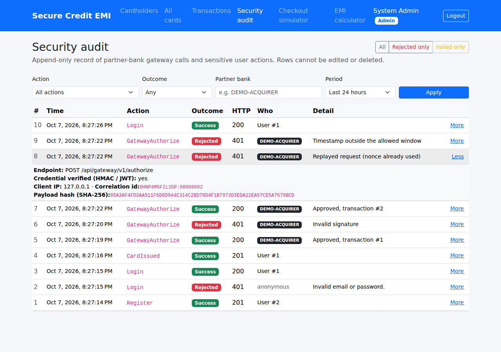

# Module 5 – Inter-Bank Payload Security + Security Audit Log

**Goal of this module** (spec §1, §4A, §6):

> *Inter-Bank End-to-End Payload Security: symmetrical AES-256 payload encryption coupled with asymmetrical
> Digital Signatures (HMAC/RSA) for tamper-proof data transport between third-party bank gateways and the
> provider API.*
>
> *Every incoming request carries an HMAC-SHA256 signature calculated from the raw payload and a shared
> secret. The API middleware verifies the signature prior to processing.*

At the end of this module:

- partner banks call a **server-to-server gateway** (`POST /api/gateway/v1/authorize`) **without** a user
  login. They prove who they are with an **HMAC-SHA256 signature**,
- the card data travels **AES-256 encrypted**, and our answer goes back **encrypted and signed**,
- forged, tampered, **replayed** and **stale** requests are rejected before any business code runs,
- the partner's signature is stored with the transaction (`Transactions.DigitalSignature`) as proof,
- an **append-only `SecurityAuditLogs`** table records every gateway call and every sensitive user action,
- admins have a **Security audit** page, and a **Partner Bank Simulator** lets you try the gateway yourself.

| Security audit page |
|---|
|  |

**Delivered in five parts:** A – schema, domain and application · B – infrastructure (crypto, audit writer) · C – gateway middleware, `[Audit]` filter and audit API · D – Partner Bank Simulator and Security audit page · E – integration tests and this guide

---

## Contents

1. [Why a separate gateway?](#step-1--why-a-separate-gateway)
2. [The wire protocol](#step-2--the-wire-protocol)
3. [Crypto services: the spec's code, fixed](#step-3--crypto-services)
4. [The middleware, check by check](#step-4--the-middleware)
5. [Replay protection: timestamp + nonce](#step-5--replay-protection)
6. [The gateway controller and DigitalSignature](#step-6--the-gateway-controller)
7. [Security audit log](#step-7--security-audit-log)
8. [Configuration: partner keys](#step-8--configuration)
9. [Partner Bank Simulator](#step-9--partner-bank-simulator)
10. [Tests](#step-10--tests)
11. [Run it and try it](#step-11--run-it-and-try-it)
12. [Production notes](#step-12--production-notes)

---

## Step 1 – Why a separate gateway?

So far every call came from a **person** in a browser with a **JWT** token. In real card payments the
purchase request comes from the **merchant's bank** (the *acquirer*) or a payment gateway, **machine to
machine**. There is no user to log in. Instead:

| Question | Browser user | Partner bank |
|---|---|---|
| Who is calling? | JWT signed by us (`sub`, `role`) | `X-Partner-Id` + HMAC signature with a shared key |
| Can it be read in transit? | HTTPS | HTTPS **and** AES-256 encrypted payload (end-to-end, survives TLS-terminating proxies) |
| Was it changed? | JWT signature covers only the token | the signature covers the **whole** request |
| Can it be replayed? | token reuse until expiry | **no**: every request has a timestamp and a single-use nonce |

---

## Step 2 – The wire protocol

`backend/src/SecureEmiCard.Api/InterBank/InterBankProtocol.cs`

**Request**

```
POST /api/gateway/v1/authorize
X-Partner-Id : DEMO-ACQUIRER
X-Timestamp  : 1791408437                       (Unix seconds, UTC)
X-Nonce      : 6F2C0B9E4D1A...                  (random, single use)
X-Signature  : Base64( HMAC-SHA256( signingKey, canonical ) )

{ "payload": "Base64( IV | AES-256-CBC( encryptionKey, {cardNumber, expiry, cvv, pin, merchant, amount} ) )" }
```

```
canonical = "POST" \n "/api/gateway/v1/authorize" \n timestamp \n nonce \n body
```

Every value that matters is inside the signature. Changing the method, path, time, nonce or **a single
character** of the body makes the signature invalid.

**Response:** same idea, signed and encrypted by us:

```
canonical = "RESPONSE" \n statusCode \n ourTimestamp \n ourNonce \n REQUEST-nonce \n body
```

- The fixed word `RESPONSE` means a response can never be passed off as a request.
- Including the **request's** nonce ties the answer to the question: an attacker can't swap in an old
  "APPROVED" response.

**Two keys per partner.** `EncryptionKey` (AES) and `SigningKey` (HMAC) are different. The spec used one
`secretKey` for both. Using one key for two purposes is a classic mistake: if one use leaks or is weak,
both are broken.

---

## Step 3 – Crypto services

The spec's `CryptoService` and `SignatureService` (§4A), kept recognisable and fixed:

### `AesCbcPayloadCryptoService` (Infrastructure/Security)

| Spec | Problem | Ours |
|---|---|---|
| `secretKey.PadRight(32).Substring(0, 32)` | "abc" becomes `"abc" + 29 spaces`: far less than 256 bits | requires exactly **32 random bytes** |
| `CryptoStream` + `StreamWriter` | lots of code | `aes.EncryptCbc(plain, iv, PaddingMode.PKCS7)` |
| random IV prepended | ✅ correct | kept |

**AES-CBC alone doesn't detect tampering**, and a server that reports padding errors can even help an
attacker decrypt data (the *padding oracle* attack). That's why we use **encrypt-then-MAC**: the HMAC over
the cipher text is checked **first**, and only authentic messages are ever decrypted. This is also why we
didn't switch to AES-GCM here: the spec's design (AES + HMAC) is secure when done in this order.

### `HmacSignatureService` (Infrastructure/Security)

```csharp
// spec – VULNERABLE to timing attacks
return computedSig == signature;

// ours
return CryptographicOperations.FixedTimeEquals(expected, provided);
```

`==` stops at the first different character, so a slightly slower answer means "the first byte was
right". An attacker who measures thousands of requests can rebuild a valid signature byte by byte.
`FixedTimeEquals` always takes the same time.

---

## Step 4 – The middleware

`backend/src/SecureEmiCard.Api/InterBank/InterBankSecurityMiddleware.cs`, registered in `Program.cs`
**only for `/api/gateway`**:

```csharp
app.UseWhen(ctx => ctx.Request.Path.StartsWithSegments("/api/gateway"),
            gateway => gateway.UseMiddleware<InterBankSecurityMiddleware>());
```

| # | Check | Failure | Why this order |
|---|---|---|---|
| 1 | headers present, POST | 401 / 405 | cheapest checks first |
| 2 | partner exists and enabled | 401 | |
| 3 | timestamp within ±5 min | 401 | old captured requests are useless |
| 4 | body ≤ 64 KB (bounded read) | 413 | no memory exhaustion |
| 5 | **HMAC signature** (constant time) | 401 | before the nonce: attackers can't burn a partner's nonces |
| 6 | **nonce** never used | 401 | exact replays are useless |
| 7 | decrypt payload | 400 | only authentic data is decrypted |
| 8 | run the controller with the **plain** JSON, then **encrypt + sign** its response | | the controller never sees crypto |
| 9 | write `SecurityAuditLogs` | | for every request, accepted or not |

**Same message for every authentication failure.** Wrong key, unknown partner, disabled partner, stale
timestamp and replay all answer exactly `{"error":"Request authentication failed."}`. Detailed messages
would tell an attacker which partner IDs exist or which check they need to beat. The real reason is only
in the audit log.

**Errors stay inside the secure channel.** If the controller throws (for example a validation error),
the middleware turns it into ProblemDetails using the same rules as the global handler
(`Infrastructure/ExceptionMapping.cs`, new and shared), then encrypts and signs it. The partner can
trust error answers too.

---

## Step 5 – Replay protection

An attacker who records a valid, signed "pay ₹50,000" request can't change it, but could **send it again**.
Two defences work together:

1. **Timestamp:** requests older or newer than ±5 minutes (`AllowedClockSkewSeconds`) are refused.
2. **Nonce:** every nonce is remembered for 15 minutes (`NonceTtlSeconds`), and a second use is refused.

The nonce memory must last **longer than the whole timestamp window** (2 × 5 minutes). Otherwise a
request could be replayed after its nonce is forgotten but while its timestamp is still accepted. The app
refuses to start if `NonceTtlSeconds < 2 × AllowedClockSkewSeconds`.

`MemoryNonceStore` checks and records the nonce **under a lock**: two copies of the same request arriving
in the same millisecond can't both pass.

> With **several API servers**, an in-memory store isn't shared and a replay sent to another server would
> pass. Production uses Redis (`SET key NX EX 900`) or a table with a unique index. This is covered in
> Module 12 (deployment).

---

## Step 6 – The gateway controller

`Controllers/GatewayController.cs`:

```csharp
[AllowAnonymous]            // no JWT...
[RequireVerifiedPartner]    // ...but refuses to run unless the middleware verified the partner
public class GatewayController : ControllerBase
```

`[RequireVerifiedPartner]` is **defence in depth**: if someone accidentally removed the middleware line
from `Program.cs`, the endpoint would still answer 401 instead of being open to the internet.

The controller calls `TransactionService.AuthorizeFromGatewayAsync`. This is the same authorization flow
as Module 2 (CVV, expiry, PIN lockout, funds, cashback), with two differences:

- a partner may present **any** card, because it is the merchant's bank;
- the partner's request signature is stored with the ledger row: `Transactions.DigitalSignature` (a spec
  column, unused until now). This is **non-repudiation**: the partner can't later deny sending that
  purchase, because only they have the key that produced that signature.

---

## Step 7 – Security audit log

### Table: `database/05_Module5_Security_Audit.sql`

| Column | Meaning |
|---|---|
| `ActionType` | `GatewayAuthorize`, `Login`, `CardBlocked`, `PinChanged`, … (`Domain/Common/AuditActions.cs`) |
| `Outcome` | **Success** · **Rejected** (security check said no: 401/403/429, bad signature, replay) · **Failed** (allowed but failed: validation, business rule, 500) |
| `SignatureValid` | the caller's credential was cryptographically verified (partner HMAC or user JWT) |
| `PayloadHash` | SHA-256 of the received **encrypted** gateway body: proves *what* was received without storing card data |
| `UserId` / `PartnerId` / `ClientIp` / `CorrelationId` / `Detail` | who, from where, matching log line, and what happened |

**Append-only.** An audit trail that can be edited proves nothing, so the script adds:

```sql
CREATE TRIGGER dbo.TR_SecurityAuditLogs_AppendOnly ON dbo.SecurityAuditLogs
INSTEAD OF UPDATE, DELETE AS THROW 50001, N'SecurityAuditLogs is append-only...', 1;
```

Even a DBA running `DELETE FROM SecurityAuditLogs` by hand gets an error. (EF Core is told about the
trigger with `HasTrigger(...)`, because SQL Server doesn't allow EF's default `INSERT ... OUTPUT` on
tables with triggers.)

**No foreign keys, on purpose:** audit rows must survive even if a user or card is later removed.

### Writing: `Infrastructure/Auditing/AuditLogWriter.cs`

The writer saves through its **own** `DbContext` (a new DI scope), never the request's:

- a rejected request or failed login has nothing to commit, but must still be recorded;
- the request's DbContext may contain half-done changes that must not be saved by accident.

If the audit write itself fails, it logs `AUDIT WRITE FAILED` and the request continues ("fail open").
A stricter bank could choose "fail closed".

### User actions: the `[Audit]` attribute (`Api/Auditing/AuditAttribute.cs`)

No audit code inside the services. One attribute per controller action:

```csharp
[HttpPost("{cardId:int}/block")]
[Audit(AuditActions.CardBlocked)]
public async Task<ActionResult<CardDto>> Block(int cardId, CancellationToken ct) => ...
```

The filter runs after the action and records the outcome (success, rejected or failed, using the same
`ExceptionMapping`), the user from the JWT, the route values (`cardId=5`) and the business message
(*"Incorrect PIN. 2 attempt(s) left"*).

Audited actions: Register, Login, CardIssued, CardBlocked, CardUnblocked, CreditLimitChanged, PinChanged,
CardNumberRevealed, CardholderActivated/Deactivated, Refund, EmiConversion.

**Why the request body is never hashed for user actions:** it can contain a PIN or CVV. There are only
10,000 PINs, so `SHA-256(body)` could be reversed by trying them all. The fingerprint uses method, path,
user and correlation id instead.

### Reading: `GET /api/audit-logs` (Admin)

Filters: `actionType`, `outcome`, `partnerId`, `userId`, `lastHours`, plus paging. The Angular page is
**Admin → Security audit**.

---

## Step 8 – Configuration

`appsettings.json` (committed) has the defaults and **no** partners:

```json
"InterBank": { "AllowedClockSkewSeconds": 300, "NonceTtlSeconds": 900, "MaxBodyBytes": 65536, "Partners": [] }
```

`appsettings.Development.json` gets one **demo** partner:

```json
"InterBank": {
  "Partners": [
    {
      "PartnerId": "DEMO-ACQUIRER",
      "Name": "Demo Acquiring Bank (development only)",
      "EncryptionKey": "<Base64 32 bytes>",
      "SigningKey": "<Base64, at least 32 bytes, different>",
      "Enabled": true
    }
  ]
}
```

The same two keys go into `tools/PartnerBankSimulator/partner-settings.json`, because both sides share
the secret. The API refuses to start if a partner's keys are missing, too short, or identical. Generate
your own:

```powershell
[Convert]::ToBase64String([Security.Cryptography.RandomNumberGenerator]::GetBytes(32))   # EncryptionKey
[Convert]::ToBase64String([Security.Cryptography.RandomNumberGenerator]::GetBytes(48))   # SigningKey
```

---

## Step 9 – Partner Bank Simulator

`tools/PartnerBankSimulator` is a console app that **does not reference our code**. It implements the
protocol from the outside, exactly like a real partner bank would.

```powershell
cd "C:\My Projects\SecureCreditCardApp"
dotnet run --project tools/PartnerBankSimulator -- --card 4581230000000000 --expiry 10/31 --cvv 123 --pin 2580 --amount 2500 --merchant "Amazon India" --mcc 5732
```

It prints the request with the card data masked, the encrypted body on the wire, the HTTP status,
**"Response signature: valid"**, and the decrypted result.

Try the attacks:

| `--attack` | What it does | Expected |
|---|---|---|
| `tamper` | changes one character of the encrypted body after signing | 401 |
| `replay` | sends the exact same request twice | 200, then 401 |
| `stale` | timestamp 10 minutes old | 401 |
| `wrong-key` | signs with a random key | 401 |

Then open **Admin → Security audit** and see each attempt, with the real reason in *Detail*.

---

## Step 10 – Tests

```powershell
cd backend
dotnet test
```

**108 tests** (86 from Modules 1–4 + 22 new). New for this module: **integration tests** that start the
real API in memory with `WebApplicationFactory<Program>` and send real HTTP requests through the whole
pipeline.

| Test class | What it proves |
|---|---|
| `GatewayIntegrationTests` | a signed, encrypted request is approved; the response is unreadable on the wire, correctly signed and decryptable; `DigitalSignature` is stored; audit row written · tampered body → 401 · replay → 401 and charged once · ±10 min timestamp → 401 · wrong key, unknown and disabled partner → **identical** 401 · an Admin JWT alone can't use the gateway · authentic but undecryptable → 400 · oversized → 413 · validation errors come back encrypted and signed |
| `AuditTrailIntegrationTests` | failed login → Rejected row without the password · block twice → Success + Failed rows with user, target and message · only Admins can read the trail |
| `PayloadSecurityTests` | AES-CBC round trip with a fresh IV; 256-bit key required · HMAC detects a one-space change and a wrong key; weak keys refused · response canonical ≠ request canonical · nonce single-use per partner · nonce format · audit values truncated, never failing |

Test settings are passed with `builder.UseSetting(...)` in `SecureEmiApiFactory`. With minimal hosting,
`Program.cs` reads configuration while registering services, and only `UseSetting` values are visible at
that moment.

---

## Step 11 – Run it and try it

1. Create the branch from `main`, apply the files, and run the SQL script:

   ```powershell
   sqlcmd -S MANGESH-GHULE\SQLEXPRESS -E -i database\05_Module5_Security_Audit.sql
   ```

2. Add the `InterBank` section to **your** `appsettings.Development.json` (Step 8).
3. Start the API and Angular as usual.
4. As your customer, **My cards → Show card number** (you need the number, the expiry, and the CVV from
   issuance).
5. Run the simulator with your card (Step 9), then each attack.
6. **Admin → Security audit**: filter *Rejected only*.
7. In SSMS:

   ```sql
   SELECT TOP 20 AuditId, Timestamp, ActionType, Outcome, HttpStatus, PartnerId, UserId, Detail
   FROM dbo.SecurityAuditLogs ORDER BY AuditId DESC;

   SELECT TOP 5 TransactionId, MerchantName, Amount, DigitalSignature
   FROM dbo.Transactions WHERE DigitalSignature IS NOT NULL ORDER BY TransactionId DESC;

   -- prove it is append-only (this must FAIL):
   DELETE FROM dbo.SecurityAuditLogs WHERE AuditId = 1;
   ```

---

## Step 12 – Production notes

- **Keys** live in Azure Key Vault, one secret per partner, and are exchanged out-of-band (never by email).
  **Key rotation:** accept the old and new signing key for an overlap period.
- **Nonce store:** use Redis or a database table when running more than one API instance (Module 12).
- **mTLS** (client certificates) is often added on top, so only the partner's servers can even connect.
- The spec mentions **RSA** signatures as an alternative to HMAC. With RSA, the partner signs with its
  **private** key and we verify with its **public** key, so we can't forge their signatures (true
  non-repudiation), and no shared secret has to be exchanged. HMAC is simpler and faster, and fine when
  both sides trust each other with a shared key.
- Real card networks use **ISO 8583** messages and HSMs for PIN blocks. Our JSON protocol teaches the
  same ideas (integrity, confidentiality, freshness, non-repudiation) in a readable form.

---

## What's next – Module 6

**Card controls & spending limits:** switch online, international, contactless and ATM use on or off per
card, set daily and per-transaction limits, and temporarily lock the card yourself. This is the most
visible feature of every bank's card app, and RBI rules require it.
