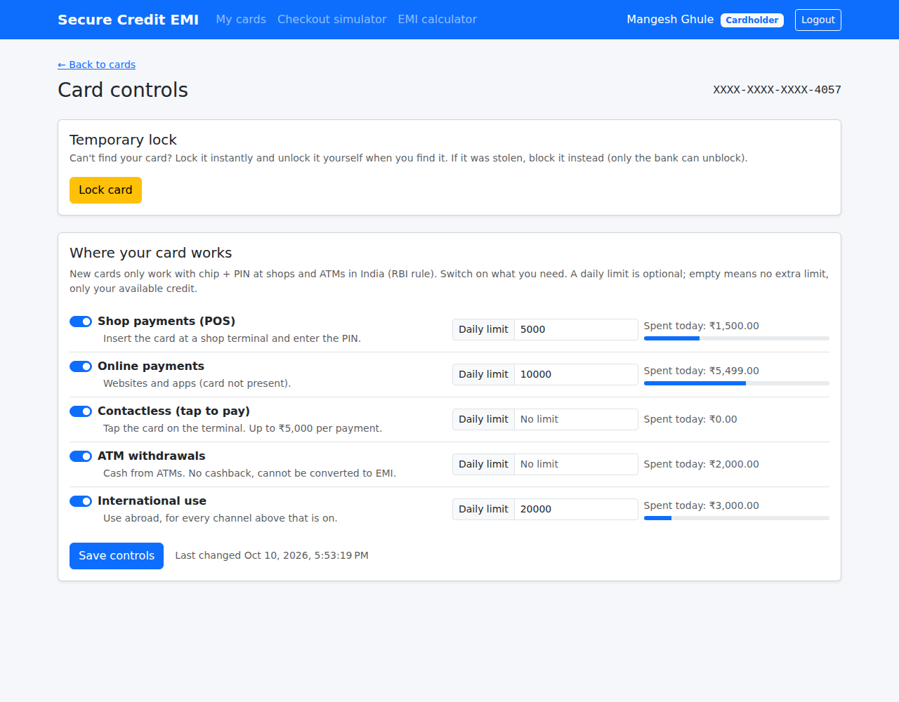
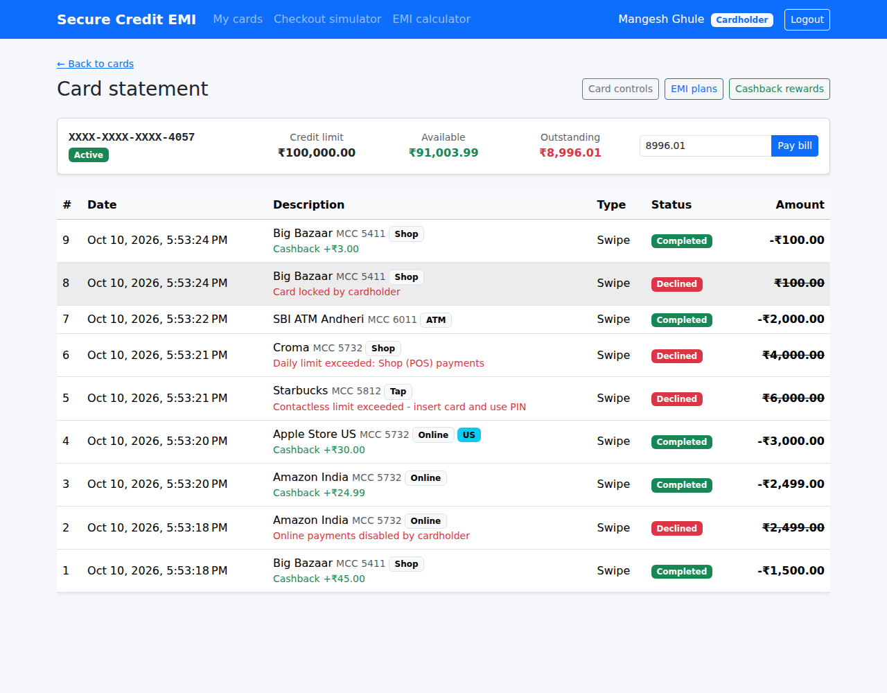
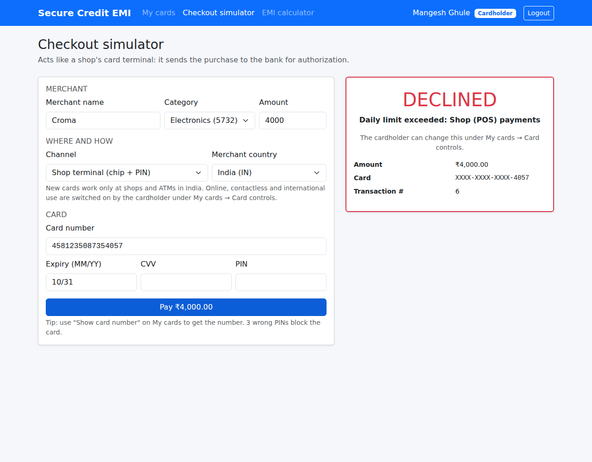
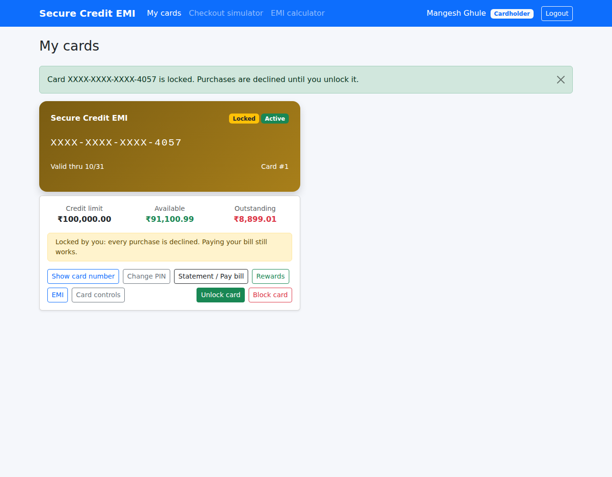

# Module 6 – Card Controls & Spending Limits

**Goal of this module:** the first feature that market EMI card apps have and the specification does not.
The bank app lets every cardholder decide **where their card works**: online, contactless, ATM, abroad.
In India this is also a regulator's rule:

> **RBI circular "Enhancing Security of Card Transactions" (January 2020), in short:** new cards work only
> at contact-based points (ATMs and shop terminals) in India. Cardholders must be able to switch on/off and
> set limits for domestic and international, POS / ATM / online / contactless use, 24x7, and get an alert
> whenever these settings change.

At the end of this module:

- each card has **controls**: switch shop (POS), online, contactless, ATM and international use **on or off**,
- an optional **daily limit** per channel and for international use, with *spent today* shown live,
- a **temporary lock** that the customer switches on and off (unlike *Block*, which only the bank can undo),
- **contactless** payments are capped at ₹5,000 each (the RBI tap-and-pay limit, configurable),
- **every** authorization is checked: the checkout simulator **and** partner banks through the gateway,
- the decline reason tells the customer exactly which switch or limit to change,
- every change is in the **security audit log**, including *what* was switched on.

| Card controls: switches, daily limits, spent today | Statement: channel, country and decline reasons |
|---|---|
|  |  |

| Checkout: declined by a daily limit | Temporarily locked card |
|---|---|
|  |  |

---

## Contents

1. [Update your local copy and the database](#step-1--update-your-local-copy-and-the-database)
2. [What market card apps offer](#step-2--what-market-card-apps-offer)
3. [Data model](#step-3--data-model)
4. [Domain: CardControl, lock vs. block](#step-4--domain-cardcontrol-lock-vs-block)
5. [Where the checks run](#step-5--where-the-checks-run)
6. [Daily limits: what is "today" and what counts](#step-6--daily-limits)
7. [Cash at ATMs is not a purchase](#step-7--cash-at-atms-is-not-a-purchase)
8. [API endpoints and the audit trail](#step-8--api-endpoints-and-the-audit-trail)
9. [Old clients keep working](#step-9--old-clients-keep-working)
10. [Angular pages](#step-10--angular-pages)
11. [Tests](#step-11--tests)
12. [Run it and try it](#step-12--run-it-and-try-it)
13. [Production notes](#step-13--production-notes)

---

## Step 1 – Update your local copy and the database

```powershell
cd "C:\My Projects\SecureCreditCardApp"
git checkout main
git pull

# BEFORE starting the API:
sqlcmd -S MANGESH-GHULE\SQLEXPRESS -E -i database\06_Module6_Card_Controls.sql
```

Or open `database\06_Module6_Card_Controls.sql` in SSMS and press **Execute**. Without it, the API fails
with `Invalid column name 'IsLocked'`.

What the script does:

| Change | Why |
|---|---|
| `CreditCards.IsLocked`, `LockedAt` | the customer's temporary lock |
| `Transactions.Channel` (`Pos` / `Online` / `Contactless` / `Atm`, CHECK) | how the card was used; NULL for repayments and EMI installments |
| `Transactions.MerchantCountry` (`NCHAR(2)`), `IsInternational` | where; stored so daily limits don't depend on today's configuration |
| existing swipes and refunds get `Channel = 'Pos'` | before Module 6 every purchase was chip + PIN at a shop |
| new table `CardControls` (1:1 with `CreditCards`, `ON DELETE CASCADE`) | switches + daily limits; `CHECK` that every limit is > 0 |
| a default `CardControls` row for every existing card | your existing cards get the RBI defaults |

`appsettings.json` gets a new, optional section (the values shown are the defaults):

```json
"CardControls": {
  "HomeCountryCode": "IN",
  "ContactlessPerTransactionLimit": 5000,
  "BusinessDayUtcOffset": "05:30:00"
}
```

You don't need to change `appsettings.Development.json` or your User Secrets.

---

## Step 2 – What market card apps offer

Every bank app in India (HDFC MyCards, ICICI iMobile, SBI Card, Axis, …) has a *Manage card* screen.
This module builds the same features:

| Feature | Market apps | Here |
|---|---|---|
| Switch each channel on/off | ✅ | POS, online, contactless, ATM |
| International use on/off | ✅ | separate switch, applies to every channel |
| Daily limit per channel | ✅ | optional, within the credit limit |
| Temporary lock / "freeze" | ✅ | customer locks and unlocks; Block stays a bank action |
| New cards: domestic contact use only | RBI rule | defaults: POS ✅ ATM ✅ online ❌ contactless ❌ international ❌ |
| Contactless cap per payment | ₹5,000 (RBI) | `CardControls:ContactlessPerTransactionLimit` |
| OTP before switching something **on** | ✅ | Module 7 |
| SMS / e-mail alert for every change | ✅ | Module 7 |

**Lock vs. Block**

| | Lock (Module 6) | Block (Module 1/2) |
|---|---|---|
| Who sets it | cardholder | cardholder, bank, or 3 wrong PINs |
| Who removes it | cardholder | **only the bank** |
| Use case | "I can't find my card" | lost / stolen / fraud |
| Stored as | `CreditCards.IsLocked` | `CreditCards.CardStatus = 'Blocked'` |
| Paying the bill | ✅ works | ✅ works |

---

## Step 3 – Data model

```
CreditCards (1) ───── (1) CardControls          Transactions
  IsLocked                PosEnabled, PosDailyLimit        Channel          Pos | Online | Contactless | Atm
  LockedAt                OnlineEnabled, OnlineDailyLimit  MerchantCountry  'IN', 'US', ...
                          ContactlessEnabled, ...           IsInternational
                          AtmEnabled, ...
                          InternationalEnabled, InternationalDailyLimit
                          UpdatedAt
```

`CardControls.CardId` is **both** the primary key and the foreign key. This is the classic way to model a
1:1 relationship: a card can never have two control rows.

EF Core (`Infrastructure/Persistence/Configurations`):

```csharp
// CreditCardConfiguration
b.HasOne(x => x.Controls).WithOne()
 .HasForeignKey<CardControl>(x => x.CardId)
 .OnDelete(DeleteBehavior.Cascade);

// CardControlConfiguration
b.HasKey(x => x.CardId);
b.Property(x => x.CardId).ValueGeneratedNever(); // = CreditCards.CardId
```

The `CreditCard` constructor creates the default controls, so **issuing a card** inserts both rows in
one `SaveChanges`. `GetByIdAsync` and `GetByNumberHashAsync` load them with `Include(c => c.Controls)`.
If a card has no row (an old card on a database where the script was not run), `card.EnsureControls()`
gives it the defaults, and EF inserts the row with the next save.

---

## Step 4 – Domain: CardControl, lock vs. block

`Domain/Entities/CardControl.cs` holds the rules, and has no database or services:

```csharp
public static CardControl CreateDefault() => new() { PosEnabled = true, AtmEnabled = true, ... };

public string? GetUsageDeclineReason(TransactionChannel channel, bool isInternational)
{
    if (!IsEnabled(channel)) return DeclineReasons.ChannelDisabled(channel);
    if (isInternational && !InternationalEnabled) return DeclineReasons.InternationalDisabled;
    return null;
}

public string? GetLimitDeclineReason(channel, isInternational, amount, DailySpend spentToday, contactlessCap)
{
    if (channel == Contactless && amount > contactlessCap) return ContactlessLimitExceeded;
    if (channelLimit is not null && spentToday.For(channel) + amount > channelLimit) return DailyLimitExceeded(channel);
    if (isInternational && InternationalDailyLimit is not null && spentToday.International + amount > ...) ...
    return null;
}
```

- **`Update(...)` checks every limit before it changes anything.** If the 4th limit is invalid, the first
  three are not half-applied. A limit must be greater than zero and not above the credit limit.
- **Reaching a limit exactly is allowed:** ₹600 spent + ₹400 with a ₹1,000 limit is approved; ₹400.01 is not.
- `CreditCard.Lock()` / `Unlock()`: a blocked card cannot be locked (the bank's block wins), and locking
  twice is an error. `GetSwipeDeclineReason` and `Debit` also refuse a locked card, so no code path can
  spend on it.

New decline reasons (`Domain/Common/DeclineReasons.cs`), worded so the customer knows what to change:

| Reason | Card network equivalent |
|---|---|
| `Card locked by cardholder` | ISO 8583 response code 57 |
| `Online payments disabled by cardholder` (and Shop / Contactless / ATM) | 57 "transaction not permitted to cardholder" |
| `International use disabled by cardholder` | 57 |
| `Daily limit exceeded: Online payments` (and the other channels, International use) | 61 "exceeds amount limit" |
| `Contactless limit exceeded - insert card and use PIN` | a "soft decline": the terminal asks for chip + PIN |

---

## Step 5 – Where the checks run

All checks are in **one** place, `TransactionService.AuthorizeAsync`, which both the checkout simulator
and the partner-bank gateway (Module 5) use. The order matters:

| # | Check | Decline | Why here |
|---|---|---|---|
| 1 | card exists (blind index) | Invalid card details | |
| 2 | expiry + CVV | Invalid card details | |
| 3 | blocked / expired | Card blocked / expired | |
| **3b** | **lock, channel switch, international switch** | **Card locked … / … disabled by cardholder** | **before the PIN** |
| 4 | PIN (3 strikes) | Incorrect PIN | |
| **5** | **contactless cap, daily limits** | **Contactless limit… / Daily limit exceeded…** | needs a DB query, so only after authentication |
| 6 | available credit | Insufficient credit | |
| 7–8 | debit, ledger row, cashback | | |

**Why the switches run before the PIN.** A locked card or a switched-off channel must be useless, even for
guessing PINs. If the PIN came first, a thief with a locked card could still use it to find the PIN (and
block the card for its owner). A test proves it: a wrong PIN on a locked card leaves
`FailedPinAttempts` at 0.

Every decline is still written to the ledger **with its channel and country**, so the customer sees
*"Online payments disabled by cardholder"* in the statement and knows which switch to turn on.

---

## Step 6 – Daily limits

**What is "today"?** Midnight to midnight in **India** (IST, UTC+05:30), not in UTC. At 01:30 at night in
India it is still 20:00 *yesterday* in UTC, and the customer expects a new day.

```csharp
public static DateTime StartOfBusinessDayUtc(DateTime nowUtc, TimeSpan utcOffset)
{
    var localMidnight = (nowUtc + utcOffset).Date;
    return DateTime.SpecifyKind(localMidnight - utcOffset, DateTimeKind.Utc);
}
// 2026-10-10 20:00 UTC → started 2026-10-10 18:30 UTC (= 11 Oct 00:00 IST)
```

A fixed offset is exact for India (no daylight saving) and behaves the same on Windows and Linux, unlike
time-zone IDs.

**What counts:** approved purchases since that moment (`Completed` **and** `Refunded`), grouped per channel
and abroad: one small `GROUP BY` that uses the existing index `IX_Transactions_CardId_Date`.

- Declined attempts **don't** count. They never took money.
- Refunded purchases **do** count. Banks limit what was *authorized* today; a refund doesn't give back
  daily limit (otherwise "buy, refund, buy again" would bypass it).

**Race safety, without new code.** Two swipes at the same moment could both see "₹600 spent" and both
pass a ₹1,000 limit. But both also change `CreditCards.AvailableBalance`, which is a concurrency token
(Module 2). The second save fails, the swipe is retried with fresh data, and the retry sees the first
purchase in today's spend.

---

## Step 7 – Cash at ATMs is not a purchase

An ATM withdrawal (channel `Atm`) is a *cash advance*, a different product:

| Rule | Where |
|---|---|
| must use merchant category **6011** (cash), and 6011 is only valid with `Atm` | `SwipeRequestValidator` |
| earns **no cashback** | `AuthorizeAsync`: `txn.IsCashWithdrawal ? CashbackQuote.None : …` |
| **cannot be converted to EMI** | `CardTransaction.GetEmiIneligibilityReason` |
| **cannot be refunded** | `CardTransaction.Refund()`; the admin page hides the button |

Cash-advance fees and interest from day one belong to billing (Module 8).

---

## Step 8 – API endpoints and the audit trail

`Api/Controllers/CardControlsController.cs`:

| Method | Route | Who | Purpose |
|---|---|---|---|
| GET | `/api/cards/{cardId}/controls` | owner, Admin (read-only) | switches, limits, spent today |
| PUT | `/api/cards/{cardId}/controls` | **owner only** | replace all switches and limits |
| POST | `/api/cards/{cardId}/lock` | **owner only** | temporary lock |
| POST | `/api/cards/{cardId}/unlock` | **owner only** | remove the lock |

Admins get **403** when they try to change a customer's controls: support staff can see the settings to
help a customer, but changing them is the customer's decision. The bank's own tools stay *Block / Unblock*
and the credit limit. Another cardholder gets **404**, so they can't even learn that the card exists.

```json
PUT /api/cards/5/controls
{
  "pos":           { "enabled": true,  "dailyLimit": 5000 },
  "online":        { "enabled": true,  "dailyLimit": 10000 },
  "contactless":   { "enabled": true,  "dailyLimit": null },
  "atm":           { "enabled": true,  "dailyLimit": null },
  "international": { "enabled": false, "dailyLimit": null }
}
```

**Audit trail.** Three new action types: `CardControlsChanged`, `CardLocked`, `CardUnlocked`. A plain
"controls changed" row doesn't help when a customer disputes an online payment, so the controller adds a
summary of the new settings to the audit row:

```csharp
HttpContext.SetAuditDetail(Summary(controls));
// cardId=5 | POS on (limit 5000.00) · Online on (limit 10000.00) · Contactless on · ATM on · International off
```

`SetAuditDetail` (in `Api/Auditing/AuditAttribute.cs`) is a small extension: the `[Audit]` filter now
also records a detail that the action provides. Only settings go in there, never card data.

---

## Step 9 – Old clients keep working

`SwipeRequest` gets two **optional** fields:

```csharp
public record SwipeRequest(..., decimal Amount,
    TransactionChannel Channel = TransactionChannel.Pos,
    string? MerchantCountry = null);
```

A client from Modules 2–5 that doesn't send them is treated as **chip + PIN at a shop in India**, the
only thing that existed before. An integration test sends exactly such JSON. Partner banks can now send
`"channel": "Online", "merchantCountry": "US"`, and the simulator has `--channel` and `--country`:

```powershell
dotnet run --project tools/PartnerBankSimulator -- --card <number> --expiry 10/31 --cvv <cvv> --pin <pin> --amount 1200 --channel Online --country US
```

---

## Step 10 – Angular pages

| Page | What's new |
|---|---|
| **Card controls** (`/cards/:id/controls`, new) | lock / unlock, a switch + daily limit per channel, *spent today* with a progress bar; read-only for admins and blocked cards |
| **My cards** | *Locked* badge (amber card), **Lock / Unlock card** button, **Card controls** link |
| **Checkout simulator** | **Channel** (shop / online / tap / ATM) and **Merchant country**; ATM switches the category to 6011; a hint when the decline is something the cardholder can change |
| **Statement** and **Admin → Transactions** | channel badge (*Shop*, *Online*, *Tap*, *ATM*) and country badge for international rows |
| **Admin → All cards** | *Locked* badge and a **Controls** link (read-only view) |

New files: `core/models/card-controls.models.ts`, `core/services/card-controls.service.ts`,
`features/cards/card-controls/card-controls.{ts,html}`.

---

## Step 11 – Tests

```powershell
cd backend
dotnet test
```

**135 tests** (108 from Modules 1–5 + 27 new):

| Test class | What it proves |
|---|---|
| `Domain/CardControlTests` | RBI defaults · switched-off channel / international declined · lock stops spending but not repayments · lock/unlock state rules · limit reached exactly is OK, 1 paisa more is not · international limit counts all channels abroad · contactless cap · invalid update changes nothing · IST business day boundaries · ATM cash: no EMI, no refund · refund keeps channel and country |
| `Application/CardControlFlowTests` | online works only after switching it on · locked card declined **without using a PIN attempt** · international needs both switches, stored on the ledger · daily limit counts only today's approved spend per channel · refunded purchase still counts · contactless cap · ATM needs MCC 6011, no cashback · only the cardholder changes controls, admins can look · limit above credit limit / blocked card rejected |
| `Api/CardControlsIntegrationTests` | swipe JSON **without** channel = shop purchase in India · controls PUT + lock through HTTP, audit rows with the settings summary · admin reads (200) but cannot lock (403) |
| `Api/GatewayIntegrationTests` (+1) | a partner bank's online purchase from the US is declined by the cardholder's controls, inside the signed + encrypted channel |

---

## Step 12 – Run it and try it

1. Run the SQL script (Step 1), start the API and Angular as usual.
2. As your customer: **Checkout simulator**, channel *Online checkout* → **DECLINED – Online payments
   disabled by cardholder** (the RBI default).
3. **My cards → Card controls**: switch on *Online payments* and *International use*, set a *Shop
   payments* daily limit of 5,000, **Save controls**.
4. Checkout again: online ✅; online from *United States* ✅ (with a **US** badge in the statement);
   shop purchases until the 5,000 limit, then **Daily limit exceeded**; tap to pay 6,000 → **Contactless
   limit exceeded**; *ATM cash withdrawal* → approved, no cashback.
5. **My cards → Lock card**, try to pay → **Card locked by cardholder**. *Pay bill* still works. **Unlock card**.
6. As admin: **All cards → Controls** (read-only), **Security audit**, filter *CardControlsChanged*.
7. In SSMS:

   ```sql
   SELECT * FROM dbo.CardControls;

   SELECT TOP 20 TransactionId, Channel, MerchantCountry, IsInternational, Amount, TransactionStatus, DeclineReason
   FROM dbo.Transactions ORDER BY TransactionId DESC;

   SELECT TOP 10 Timestamp, ActionType, Outcome, UserId, Detail
   FROM dbo.SecurityAuditLogs
   WHERE ActionType IN (N'CardControlsChanged', N'CardLocked', N'CardUnlocked')
   ORDER BY AuditId DESC;
   ```

---

## Step 13 – Production notes

- **Step-up authentication (Module 7).** Switching something **off**, lowering a limit or locking makes
  the card *safer*, so a login is enough. Switching something **on** (international, online), raising a
  limit or **unlocking** makes it *riskier*: real apps ask for an OTP first. That is the next module.
- **Alerts.** RBI requires an SMS / e-mail to the customer for every change of these settings (Module 7).
- **Channel and country in real networks.** The acquirer doesn't send a "channel" word. The issuer reads
  it from ISO 8583 field 22 (*POS entry mode*: chip, contactless, e-commerce) and the merchant's country
  from field 19 / 43. Our JSON fields teach the same idea.
- **Contactless and the PIN.** Real tap-to-pay up to the limit needs no PIN (the card's cryptogram proves
  it is present). This simulator keeps CVV + PIN for every channel, so security never gets weaker for
  learning purposes.
- **Fraud rules (Module 10)** will add the bank's own limits (velocity, unusual country) on top of the
  customer's.

---

## What's next – Module 7

**OTP / two-factor authentication + notifications:** one-time passwords for risk-increasing actions
(unlock, switching on international or online use, raising a limit, PIN change, card number reveal), and
an alert to the customer for every transaction and every change to their card.
