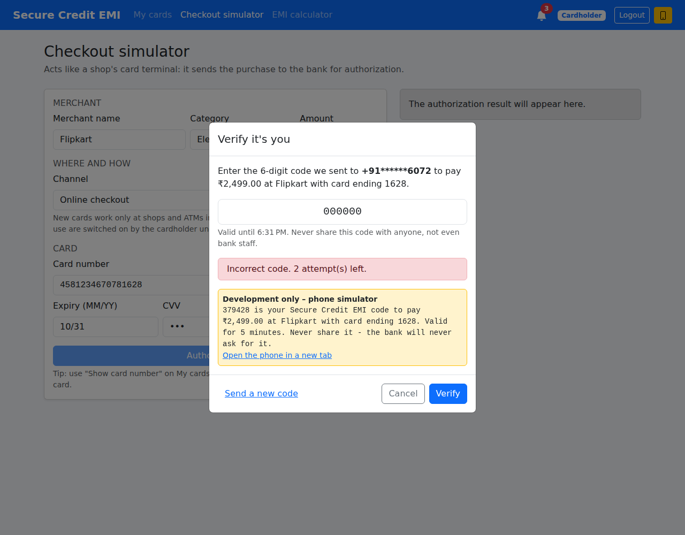
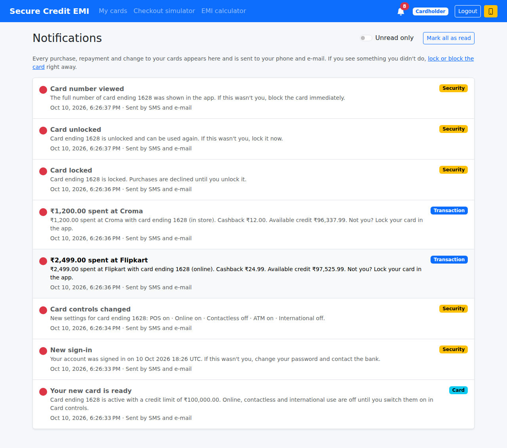
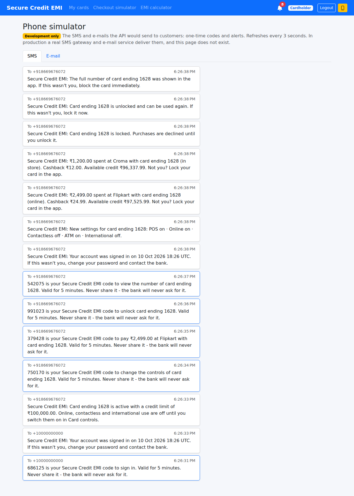
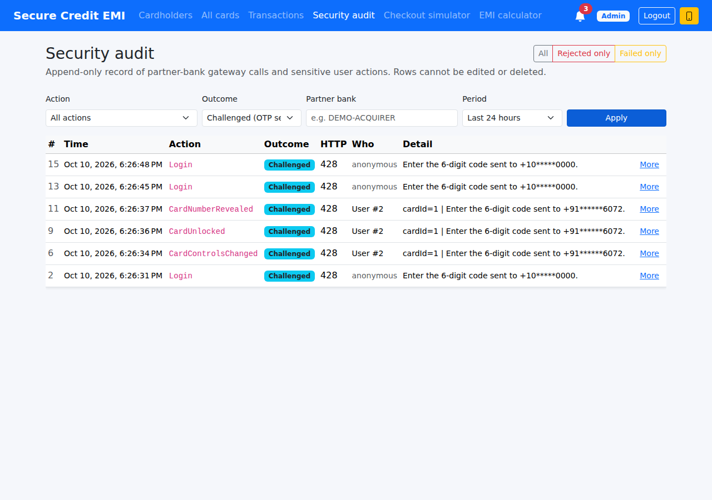

# Module 7 – OTP / Two-Factor Authentication + Notifications

**Goal of this module:** two things every Indian card app has and the specification does not.

1. **One-time codes (OTP) for risky actions.** RBI requires an *additional factor of authentication* for
   online card payments (3-D Secure: "enter the OTP sent to your phone"). Banks also ask for an OTP before
   sensitive changes: unlocking the card, switching on international use, changing the PIN.
2. **Alerts for everything.** RBI requires an SMS / e-mail for every card transaction and for every change of
   the card's controls, so a customer notices fraud within seconds.

At the end of this module:

- risky requests are answered with **HTTP 428** and a 6-digit code is sent by SMS. The app shows a
  *Verify it's you* dialog and sends the **same request again** with the code:
  - admin sign-in;
  - online payments (the code is tied to the amount and the merchant);
  - unlocking a card;
  - card-control changes that make the card riskier;
  - PIN change;
  - viewing the card number.
- the codes are random, stored only as a hash, valid for 5 minutes, allow 3 attempts, can be used **once**,
  and only work for **the action they were sent for**. At most 10 codes per 15 minutes per person.
- **every** purchase, decline, repayment, refund, EMI and card/security change creates an **alert**:
  - an in-app inbox with an unread badge on a bell icon;
  - SMS + e-mail, delivered by a background dispatcher (transactional outbox).
- a **Phone simulator** (development only) shows the SMS and e-mails the API "sent".
- the security audit log gets a new outcome: **Challenged** (a code was sent first).

| The code dialog (wrong code entered first) | Notifications inbox |
|---|---|
|  |  |

| Phone simulator (development only) | Security audit: Challenged → Success |
|---|---|
|  |  |

---

## Contents

1. [Update your local copy and the database](#step-1--update-your-local-copy-and-the-database)
2. [What market card apps do](#step-2--what-market-card-apps-do)
3. [The protocol: 428, then the same request with the code](#step-3--the-protocol)
4. [The step-up authenticator](#step-4--the-step-up-authenticator)
5. [Which actions ask for a code, and when](#step-5--which-actions-ask-for-a-code)
6. [Online payments: 3-D Secure in miniature](#step-6--online-payments)
7. [Two-step sign-in for admins](#step-7--two-step-sign-in-for-admins)
8. [Alerts and the transactional outbox](#step-8--alerts-and-the-transactional-outbox)
9. [Delivering SMS and e-mail](#step-9--delivering-sms-and-e-mail)
10. [API endpoints](#step-10--api-endpoints)
11. [Angular: one interceptor for every OTP](#step-11--angular)
12. [Two fixes along the way](#step-12--two-fixes-along-the-way)
13. [Tests](#step-13--tests)
14. [Run it and try it](#step-14--run-it-and-try-it)
15. [Production notes](#step-15--production-notes)

---

## Step 1 – Update your local copy and the database

```powershell
cd "C:\My Projects\SecureCreditCardApp"
git checkout main
git pull

# BEFORE starting the API:
sqlcmd -S MANGESH-GHULE\SQLEXPRESS -E -i database\07_Module7_Otp_Notifications.sql
```

Or open the script in SSMS and press **Execute**.

| Change | Why |
|---|---|
| new table `OtpChallenges` | one row per code sent: **hash** of the code, what it approves, attempts, expiry, status |
| new table `Notifications` | the inbox **and** the SMS / e-mail outbox |
| filtered index `IX_Notifications_Pending` (`WHERE DeliveryStatus = 'Pending'`) | the dispatcher finds unsent alerts without scanning the whole table |
| `CK_SecurityAuditLogs_Outcome` now allows `Challenged` | audit rows for requests answered with 428 |
| `SET QUOTED_IDENTIFIER ON` at the top (also added to script 02) | SQL Server only creates filtered indexes with this setting. SSMS has it on; `sqlcmd` doesn't (unless you pass `-I`) |

`appsettings.json` gets two optional sections; the values shown are the defaults:

```json
"Otp": {
  "ExpiryMinutes": 5, "MaxAttempts": 3, "MaxCodesPerWindow": 10, "WindowMinutes": 15,
  "RequireForAdminLogin": true, "RequireForCardholderLogin": false
},
"Notifications": { "DispatchIntervalSeconds": 5, "MaxDeliveryAttempts": 5 }
```

> **The admin sign-in now asks for a code.** After the password, a dialog opens. In development it shows
> the SMS right inside the dialog. You can also click the yellow **phone** button in the navbar.

---

## Step 2 – What market card apps do

| Feature | Market apps / RBI | Here |
|---|---|---|
| OTP for online card payments | RBI "additional factor of authentication", 3-D Secure | ✅ bound to card + amount + merchant |
| OTP before sensitive changes | ✅ (unlock, international, limits, PIN, card details) | ✅ only when the change makes the card **riskier** |
| Second factor for staff / admin portals | ✅ mandatory | ✅ `RequireForAdminLogin` |
| Customers: OTP on every sign-in | some banks (new device) | optional: `RequireForCardholderLogin` |
| SMS for every transaction | RBI mandatory | ✅ purchase, decline, repayment, refund, EMI |
| Alert when card settings change | RBI mandatory | ✅ lock, unlock, controls, PIN, card number viewed, block, limit |
| "Not you? Block your card" in the alert | ✅ | ✅ |
| In-app notification centre | ✅ | ✅ bell + inbox |

**Two-factor** means two *different kinds* of proof: something you **know** (password, PIN) and something
you **have** (the phone that receives the code). A thief who learned the password or the PIN still doesn't
have the phone.

---

## Step 3 – The protocol

```
Browser                                   API
  │ PUT /api/cards/5/controls {online:on}   │
  │ ───────────────────────────────────────►│  riskier change → create challenge #42, SMS "735102 is your code…"
  │◄─────────────────────────────────────── │  428 Precondition Required
  │   { "otp": { "challengeId": 42, "sentTo": "+91******6072",
  │              "description": "to change the controls of card ending 4057",
  │              "expiresAt": "...", "codeLength": 6 } }
  │                                         │
  │  (dialog: user types 735102)            │
  │ PUT /api/cards/5/controls {online:on}   │
  │   X-Otp-Challenge-Id: 42                │
  │   X-Otp-Code: 735102                    │
  │ ───────────────────────────────────────►│  verify #42 → Used → apply the change
  │◄─────────────────────────────────────── │  200 OK
```

- **Why 428?** *Precondition Required* means "this request is fine, but send it again with a precondition".
  It isn't 401 (you *are* signed in), and it isn't 403 (nothing is forbidden yet).
- **Why headers?** The protected endpoints, DTOs and routes don't change at all. Any request can become
  OTP-protected, and the Angular side handles all of them in one place (Step 11).
- **The response never contains the code**, only where it was sent (masked) and what it is for.
- A wrong, expired or already-used code → **403** with `"otpFailed": true` (the dialog stays open and shows
  *"Incorrect code. 2 attempt(s) left."*). Too many codes requested → **429**.

---

## Step 4 – The step-up authenticator

`Application/Features/Otp/StepUpAuthenticator.cs`: one method, `RequireAsync(StepUpRequest)`.

```csharp
public sealed record StepUpRequest(int CardholderId, OtpPurpose Purpose, string Context, string Description);

await _stepUp.RequireAsync(new StepUpRequest(card.CardholderId, OtpPurpose.UnlockCard,
    $"card={card.CardId}", $"to unlock {Alerts.CardName(card)}"), ct);
```

**No code in the request → issue a new one:**

| Rule | How |
|---|---|
| 6 random digits | `RandomNumberGenerator.GetInt32(0, 1_000_000)`. Never `Random`, whose output can be predicted |
| never stored in clear | `CodeHash` = the same peppered hash as the PIN (`ISecretHasher`); the code exists only in memory and in the SMS, never in logs |
| bound to ONE action | `ContextHash` = SHA-256 of `Purpose \| Context`, e.g. `OnlinePayment\|card=5\|amount=2499.00\|merchant=Flipkart` |
| no secrets in the context | a context with the PIN in it would put a reversible PIN hash in the database |
| flood protection | at most 10 codes per cardholder per 15 minutes → 429 (SMS cost a bank money; attackers abuse that) |
| "Send a new code" | earlier pending codes for the same action become `Superseded` |
| masked destination | `+918669676072` → `+91******6072` |

**A code in the request → verify it** (`OtpChallenge.Verify`, in the domain):

| Situation | Result |
|---|---|
| right person, right action, correct code, not expired | `Used`: the action runs, **once** |
| wrong code | attempt counted; *"2 attempt(s) left"*; after 3 → `Failed` |
| expired (5 min), used, failed or superseded | refused, *"Request a new code"* |
| code from another action or person | refused, and it doesn't use up an attempt of the real challenge |

Three details that matter:

- **The result is saved immediately**, before the action runs, like a wrong PIN. A wrong attempt must count
  even though we throw; a correct code must be used up even if the action then fails.
- **`Status` and `Attempts` are concurrency tokens.** Two requests racing with the same code can't both
  succeed: the second save fails.
- **Scoped per HTTP request**, it remembers what it already verified. If the action hits a concurrency
  conflict and is retried (Module 2's retry helper), the retry doesn't fail with "code already used".

---

## Step 5 – Which actions ask for a code

| Action | Code? | Where |
|---|---|---|
| Sign in as **admin** | ✅ always (configurable) | `AuthService.LoginAsync` |
| Sign in as cardholder | ❌ (✅ if `RequireForCardholderLogin`) | `AuthService.LoginAsync` |
| **Online** payment (checkout simulator) | ✅ always, bound to amount + merchant | `TransactionService.AuthorizeAsync` |
| Shop / contactless / ATM payment | ❌ (card present + PIN) | |
| **Unlock** card | ✅ | `CardControlService.UnlockAsync` |
| Lock card | ❌: it makes the card **safer** | |
| Card controls: switch something **on**, **raise** or **remove** a limit | ✅ | `CardControlService.UpdateAsync` |
| Card controls: switch off, lower a limit | ❌ | `CardControl.IsRiskIncrease` decides |
| **Change PIN** | ✅ after the current PIN is correct | `CardService.ChangePinAsync` |
| **View card number** | ✅ after the PIN is correct | `CardService.RevealCardNumberAsync` |
| Block card | ❌: safer | |

**The order inside every service is the same:**

1. **cheap checks first**: validation, ownership, "card is not locked", the PIN, every limit;
2. **then the code**: no SMS is sent for an action that would fail anyway, and a wrong PIN never triggers an SMS;
3. **then the change**.

---

## Step 6 – Online payments

In `TransactionService.AuthorizeAsync`, after **all** other checks (card, CVV, controls, PIN, limits, funds):

```csharp
if (origin.Channel == TransactionChannel.Online && source.AsksForOnlineOtp)
    await _stepUp.RequireAsync(new StepUpRequest(card.CardholderId, OtpPurpose.OnlinePayment,
        $"card={card.CardId}|amount={r.Amount:0.00}|merchant={merchant}",
        $"to pay {Alerts.Money(r.Amount)} at {merchant} with {Alerts.CardName(card)}"), ct);
```

- **Dynamic linking:** the code is tied to the amount and the merchant, and the SMS says them:
  *"379428 is your Secure Credit EMI code to pay ₹2,499.00 at Flipkart with card ending 1628."* Malware that
  swaps ₹2,499 for ₹49,999 after you typed the code gets "code not valid for this action".
- **No SMS for a payment that would be declined anyway** (online switched off, not enough credit).
- **Partner banks (the Module 5 gateway) are not asked:** in real life the acquirer runs 3-D Secure with the
  issuer *before* sending the authorization. The test `Partner_banks_do_3ds_themselves_so_the_gateway_asks_no_code`
  documents this.

---

## Step 7 – Two-step sign-in for admins

An admin can see and block every card, change credit limits, and issue cards. A stolen admin password
must not be enough, so `Otp:RequireForAdminLogin` is `true`. The login request goes through the same 428
protocol; the Angular login page didn't change.

Customers get codes for their risky actions instead. Set `Otp:RequireForCardholderLogin: true` to ask them at
every sign-in too.

Every successful sign-in also sends a **"New sign-in"** alert.

---

## Step 8 – Alerts and the transactional outbox

`Domain/Entities/Notification.cs` is one row in `Notifications`. Each service adds the alert **before** its
`SaveChanges`:

```csharp
card.Debit(r.Amount);
await _transactions.AddAsync(txn, ct);
await _notifier.AddAsync(card, Alerts.PurchaseApproved(card, txn, cashback.Amount), ct);
await _unitOfWork.SaveChangesAsync(ct);   // purchase + cashback + alert: ONE database transaction
```

This is the **transactional outbox** pattern:

- the alert is committed **in the same transaction** as the change. There is never an alert for a payment
  that was rolled back, and never a payment without its alert;
- sending the SMS is **not** part of the request. A slow or failing SMS provider can't break or slow down a
  payment.

**All texts are in one file**, `Application/Features/Notifications/Alerts.cs`, like a bank's SMS templates:

| Event | Title | Category |
|---|---|---|
| purchase / ATM cash | ₹2,499.00 spent at Flipkart / Cash withdrawal ₹2,000.00 | Transaction |
| declined | Payment declined (with the reason) | Transaction |
| repayment, refund, EMI conversion, EMI installment | Payment received, Refund credited, Converted to EMI, EMI installment paid | Transaction |
| new card, blocked, unblocked, credit limit | Your new card is ready, … | Card |
| sign-in, PIN changed, card number viewed, lock, unlock, controls changed | New sign-in, … | Security |

**No secrets, ever:** cards appear as *"card ending 4057"*, and one-time codes are **never** written into
`Notifications`. The OTP SMS goes straight to the sender, because the outbox table would otherwise hold valid
codes in clear text.

`Notification.ForCard(card, ...)` uses the navigation property, so EF Core fills in `CardId` even when the
card is inserted in the same `SaveChanges` (*"Your new card is ready"* at issuance).

---

## Step 9 – Delivering SMS and e-mail

```
IMessageSender  (Application)           SendSmsAsync / SendEmailAsync
   └── SimulatedMessageSender  (Infrastructure, development + tests)  →  DevMessageOutbox (last 200, in memory)

NotificationDispatcher  (BackgroundService, every 5 s)
   Pending notifications → SMS + e-mail → Sent    (on error: retry; after 5 attempts → Failed)
```

- The dispatcher uses its **own DI scope** (a background service has no HTTP request).
- **Production guard** in `Program.cs`: outside *Development* / *Testing* the API **refuses to start** while
  only the simulator exists. A bank must never "send" OTPs into server memory.
- `GET /api/dev/messages` (the phone simulator's data) answers **404** outside Development, and an
  integration test checks that.

---

## Step 10 – API endpoints

| Method | Route | Who | Purpose |
|---|---|---|---|
| GET | `/api/notifications?unreadOnly=&page=&pageSize=` | any user | own alerts, newest first |
| GET | `/api/notifications/unread-count` | any user | the bell badge |
| POST | `/api/notifications/{id}/read` | owner | mark one read (404 for someone else's) |
| POST | `/api/notifications/read-all` | any user | mark all read |
| GET | `/api/dev/messages?take=30` | anonymous, **Development only** | phone simulator |

Plus the `X-Otp-Challenge-Id` / `X-Otp-Code` headers on every protected endpoint (Step 5).

---

## Step 11 – Angular

**One interceptor for every OTP** (`core/interceptors/otp.interceptor.ts`):

```ts
export const otpInterceptor: HttpInterceptorFn = (req, next) => {
  const prompt = inject(OtpPromptService);
  return next(req).pipe(catchError(error => {
    const challenge = otpChallengeOf(error);             // 428 with an "otp" object?
    return challenge ? prompt.verify(req, next, challenge) : throwError(() => error);
  }));
};
```

`OtpPromptService.verify` opens the dialog (`shared/otp-dialog`) and repeats **the same request** with the
headers:

- wrong code → the error appears in the dialog, try again;
- *Send a new code* → repeats the request without a code (a new 428);
- *Cancel* → the page gets an error *"Verification cancelled."*;
- success → the dialog closes and the page receives its **normal** response.

No page knows about OTP: login, checkout, card controls, PIN change and *Show card number* didn't need any
OTP code.

Interceptor order in `app.config.ts`: `[jwtInterceptor, errorInterceptor, otpInterceptor]`. The OTP
interceptor is innermost, so its retry keeps the JWT header, and the error interceptor only sees the final
outcome.

| New | What |
|---|---|
| Bell in the navbar | unread badge, refreshed every 20 s and after every page change |
| **Notifications** page | inbox, *Unread only*, *Mark all as read*, delivery status per alert |
| **Phone simulator** (`/dev/phone`, yellow phone button) | SMS and e-mails, refreshed every 3 s. **A production build never registers the route** (`environment.production`), and the API answers 404 anyway |
| Security audit | outcome filter *Challenged (OTP sent)*, blue badge |

---

## Step 12 – Two fixes along the way

- **Times were shown in the wrong time zone with SQL Server.** `DATETIME2` doesn't store "this is UTC", so
  dates came back as *Unspecified*, the JSON had no `Z`, and the browser showed UTC times as Indian times.
  `AppDbContext.ConfigureConventions` now marks every `DateTime` read from the database as UTC (writes are
  unchanged). A test proves it (`UtcDateTimeTests`).
- **`sqlcmd` couldn't create filtered indexes** (script 02's unique card-number index, script 07's pending
  index) because `QUOTED_IDENTIFIER` is off by default there. Both scripts now switch it on themselves.

---

## Step 13 – Tests

```powershell
cd backend
dotnet test
```

**168 tests** (135 from Modules 1–6 + 33 new). A new helper, `tests/.../TestServices.cs`, builds the
services the way DI does, so a new dependency is wired in **one** place. `TestOtp` is the user's phone: it
captures the SMS and types the code back.

| Test class | What it proves |
|---|---|
| `Domain/OtpAndNotificationTests` | correct code accepted **once** · 3 wrong codes burn the challenge · expired / superseded codes fail · phone masking · alert texts cut to column size, read once · delivery retried then Failed · raising / removing a limit is risky, lowering / switching off is not |
| `Application/OtpFlowTests` | code by SMS, only its hash stored · used once, but a retry inside the same request is fine · a code for card 1 can't approve card 2, another person or another purpose · 3 wrong codes · *Send a new code* replaces the old one · flood protection per person |
| `Application/AlertsAndStepUpFlowTests` | online payment code bound to amount + merchant (₹500 code can't pay ₹5,000) · no SMS for a payment declined anyway · gateway asks no code · safer changes need no code, riskier ones do · wrong PIN → no SMS · every money movement and security change creates the right alert, without card number or CVV · a failed action leaves no alert |
| `Api/OtpAndNotificationsIntegrationTests` | admin sign-in: 428 (no code in the body) → wrong code 403 `otpFailed` → right code 200; audit Challenged → Rejected → Success · online purchase with codes over HTTP, alert in the inbox, SMS + e-mail delivered by the dispatcher, read-all → 0 · nobody reads or marks someone else's alerts · `/api/dev/messages` is 404 outside Development |
| `Infrastructure/UtcDateTimeTests` | dates read back from the database are UTC |

---

## Step 14 – Run it and try it

1. Run script 07 (Step 1), start the API and Angular as usual.
2. **Sign in as admin**: the *Verify it's you* dialog opens and shows the SMS (development). Enter the code.
3. As your customer:
   - **Card controls → switch on Online payments → Save**: a code is needed. Switch it off again: no code.
   - **Checkout simulator**, channel *Online checkout*: the code SMS names the amount and the shop. Try a
     wrong code first (*"Incorrect code. 2 attempt(s) left."*).
   - A *Shop terminal* payment: no code.
   - **Lock card** (no code), **Unlock card** (code), **Show card number** (PIN, then code).
4. Watch the **bell**; open **Notifications**. Then open the yellow **phone**: SMS and e-mail for each alert.
5. As admin: **Security audit**, outcome *Challenged (OTP sent)*.
6. In SSMS:

   ```sql
   SELECT TOP 10 OtpChallengeId, CardholderId, Purpose, SentTo, Status, Attempts, CreatedAt, ExpiresAt, UsedAt
   FROM dbo.OtpChallenges ORDER BY OtpChallengeId DESC;          -- no codes in there, only CodeHash

   SELECT TOP 20 NotificationId, CardholderId, Category, Title, DeliveryStatus, SentAt, ReadAt
   FROM dbo.Notifications ORDER BY NotificationId DESC;
   ```

---

## Step 15 – Production notes

- **SMS in India:** a provider (MSG91, Gupshup, Twilio, …) plus **TRAI DLT registration**: the sender ID
  and every SMS template must be registered, or operators block the message. Keep the templates in
  `Alerts.cs` and the OTP text identical to the registered ones.
- **OTP autofill:** format the SMS for the *WebOTP API* (last line `@your-domain #123456`) so phones offer
  the code automatically.
- **SMS is the weakest second factor** (SIM swap, malware reading SMS). Banks move to in-app push approval,
  device binding and passkeys (WebAuthn). The `IStepUpAuthenticator` abstraction lets you add those later
  without touching the services.
- **Several API servers:** the dispatcher must *claim* rows (e.g. `UPDATE TOP (50) … OUTPUT … WITH (READPAST)`)
  or use a message queue, so two servers don't send the same SMS.
- **Data retention:** keep `OtpChallenges` for audit for a limited time, then archive/purge.
- **Module 10 (fraud rules)** can turn this around: an unusual payment can *require* a code even in a shop.

---

## What's next – Module 8

**Billing cycle & statements:**
- a monthly statement with the minimum amount due and the due date;
- late fees and interest on the unpaid balance;
- cash-advance charges for the ATM withdrawals from Module 6;
- a PDF download;
- a "statement ready" and "payment due" alert, using this module's notifications.
