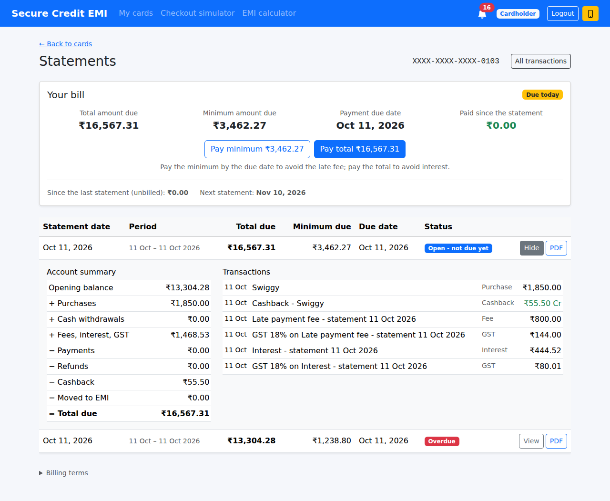
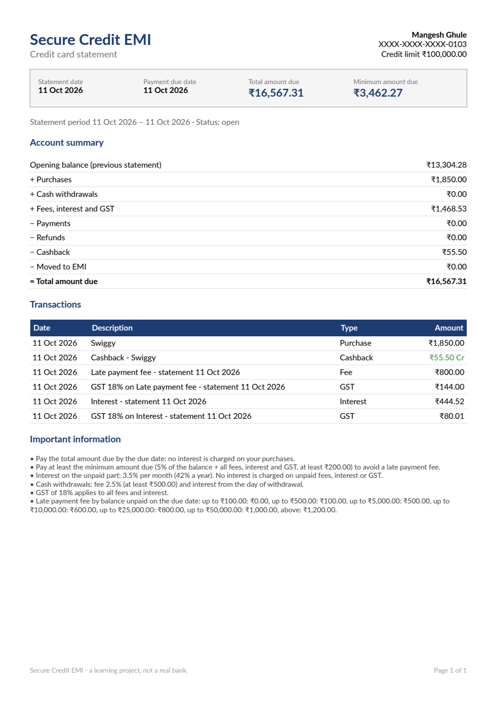
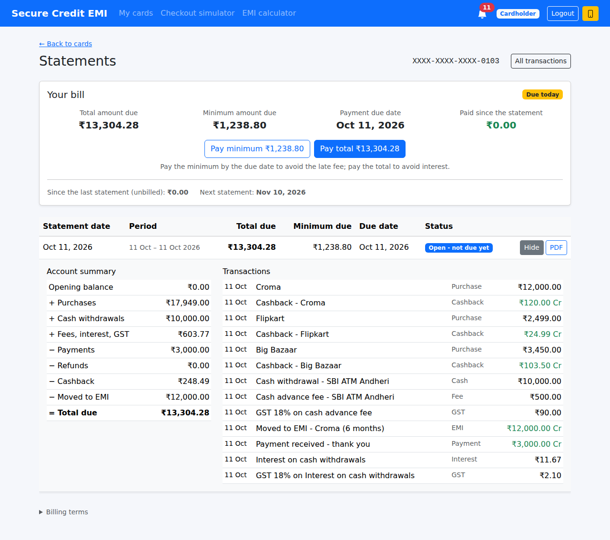
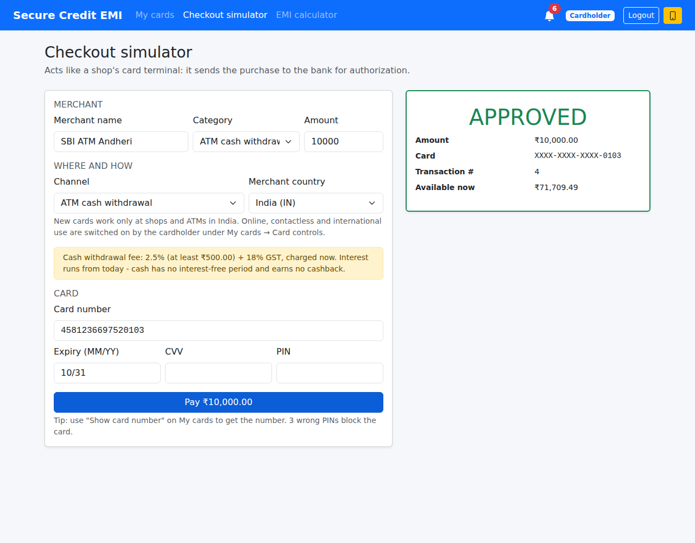
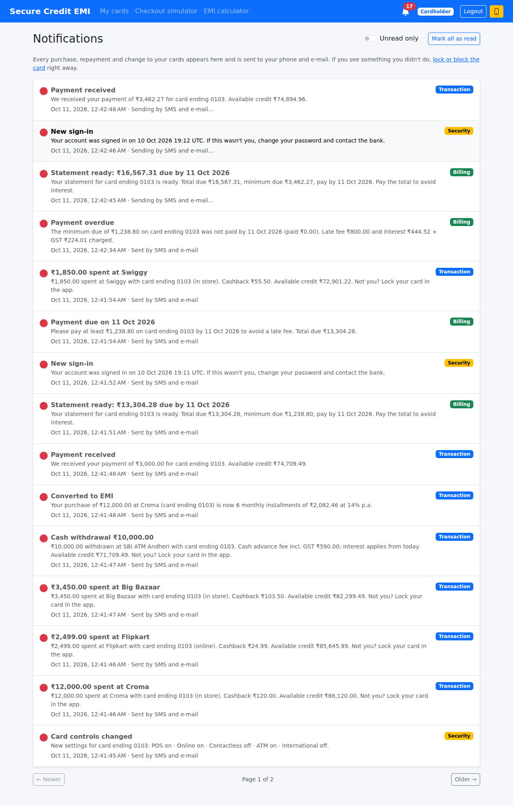
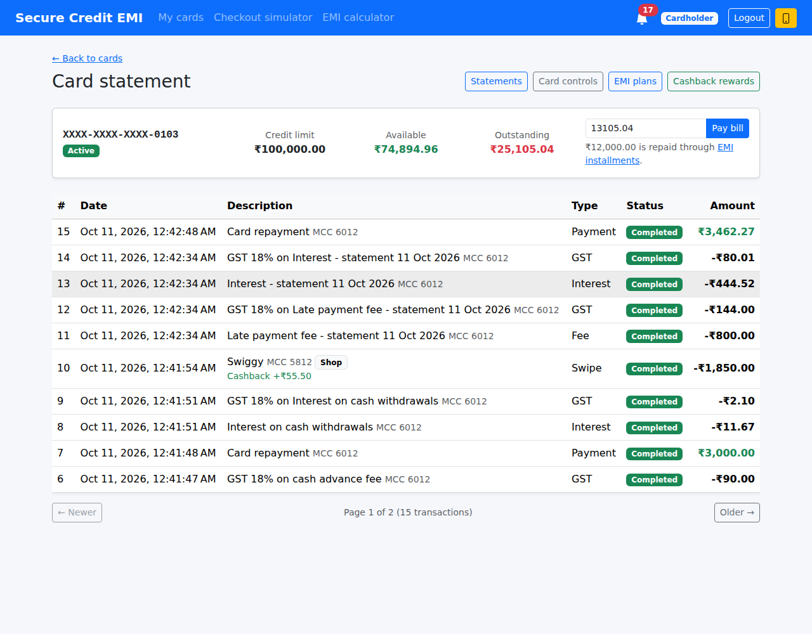

# Module 8 – Billing Cycle & Statements

**Goal of this module:** how a credit card actually charges its customer. Until now the card had a balance
and a ledger. A real card bills once a month:

1. On the **statement date** the bank closes the billing cycle and sends a **statement**:
   - everything spent, paid, refunded and earned since the last one;
   - the **total amount due**, the **minimum amount due** and the **payment due date** (about 20 days later).
2. What the customer pays by the **due date** decides the cost:
   - **paid in full** → nothing extra (the "interest-free period");
   - **minimum or more** → interest on the unpaid part, no late fee;
   - **less than the minimum** → a **late payment fee** *and* interest.
3. **Cash from an ATM** is expensive: a fee at once and interest from day one.

At the end of this module:

- the bank (or the **scheduler**, every cycle) generates a **statement** that always adds up:
  `opening + purchases + cash + fees − payments − refunds − cashback − moved to EMI = total due`;
- **minimum due** = 5 % of the balance + all fees, interest and GST + any minimum left unpaid, at least ₹200;
- after the due date: status **Paid / Minimum paid / Overdue**, **late fee** by slab, **interest** 3.5 % a
  month on the unpaid part (never on fees), **18 % GST** on fees and interest;
- **ATM cash**: 2.5 % fee (at least ₹500) + GST charged at the ATM, and interest from the withdrawal day;
- a **PDF statement** to download;
- **alerts**: *Statement ready*, *Payment due on …* (3 days before), *Payment overdue*, *Interest charged*;
- a **Statements** page with *Your bill*, *Pay minimum* / *Pay total* buttons and every statement's lines.

| Statement 2: the late fee and interest from statement 1 | The PDF |
|---|---|
|  |  |

| Statement 1: every kind of movement | ATM: the fee is shown before you withdraw |
|---|---|
|  |  |

| Alerts: statement ready, payment due, payment overdue | The ledger with the bank's charges |
|---|---|
|  |  |

---

## Contents

1. [Update your local copy and the database](#step-1--update-your-local-copy-and-the-database)
2. [How a credit card bill works](#step-2--how-a-credit-card-bill-works)
3. [The statement: "unbilled → billed"](#step-3--the-statement-unbilled--billed)
4. [The figures always add up](#step-4--the-figures-always-add-up)
5. [Minimum amount due](#step-5--minimum-amount-due)
6. [The due date: late fee and interest](#step-6--the-due-date-late-fee-and-interest)
7. [Cash withdrawals](#step-7--cash-withdrawals)
8. [Charges can take a card over its limit](#step-8--charges-can-take-a-card-over-its-limit)
9. [The scheduler and the clock](#step-9--the-scheduler-and-the-clock)
10. [Two billing runs at the same moment](#step-10--two-billing-runs-at-the-same-moment)
11. [The PDF](#step-11--the-pdf)
12. [API endpoints](#step-12--api-endpoints)
13. [Angular](#step-13--angular)
14. [Tests](#step-14--tests)
15. [Run it and try it](#step-15--run-it-and-try-it)
16. [Production notes](#step-16--production-notes)

---

## Step 1 – Update your local copy and the database

```powershell
cd "C:\My Projects\SecureCreditCardApp"
git checkout main
git pull

# BEFORE starting the API:
sqlcmd -S MANGESH-GHULE\SQLEXPRESS -E -i database\08_Module8_Billing_Statements.sql
```

Or open the script in SSMS and press **Execute**. It is safe to run more than once.

| Change | Why |
|---|---|
| new table `CardStatements` | one row per card per cycle: period, due date, every total, minimum due, status |
| `CK_CardStatements_Reconciles` | the database itself refuses a statement whose figures don't add up |
| `Transactions`, `CashbackLogs`, `EmiPlans` get `StatementId` (FK, NULL = not billed yet) | Step 3 |
| filtered indexes `IX_..._Unbilled` (`WHERE StatementId IS NULL`) | "what is not billed yet" without scanning the whole ledger |
| `CK_Transactions_Type` now allows `Fee`, `Interest`, `Tax` | the bank's charges are ledger rows like everything else |
| `CK_CreditCards_AvailableBalance` (`>= 0`) is **dropped** | Step 8 |
| `CreditCards.LastStatementDate` | when the current cycle started |
| `CK_Notifications_Category` now allows `Billing` | the new alerts |

The rows you already have stay `StatementId = NULL`, so each card's **first statement bills its whole
history**.

`appsettings.json` gets an optional `Billing` section; the values shown are the defaults:

```json
"Billing": {
  "CycleLength": "30.00:00:00",          // a statement every 30 days
  "PaymentDuePeriod": "20.00:00:00",     // statement date -> due date
  "MinimumDuePercent": 5,
  "MinimumDueFloor": 200,
  "MonthlyInterestPercent": 3.5,         // ≈ 42 % a year
  "CashAdvanceFeePercent": 2.5,
  "CashAdvanceMinimumFee": 500,
  "GstPercent": 18,
  "SchedulerInterval": "00:15:00",
  "ReminderBeforeDue": "3.00:00:00"
}
```

Late fee slabs can be configured too (`"LateFeeSlabs": [ { "UpTo": 500, "Fee": 100 }, … ]`); without them the
defaults in Step 6 apply. Durations are `days.hours:minutes:seconds`.

**New NuGet package:** `QuestPDF` (Infrastructure) for the PDF. `dotnet build` restores it.

---

## Step 2 – How a credit card bill works

| Feature | Market cards / RBI | Here |
|---|---|---|
| Monthly statement with total due, minimum due, due date | ✅ every card | ✅ `CardStatements` + PDF |
| Interest-free period when paid in full | ✅ 20–50 days | ✅ pay the total by the due date → no interest |
| Minimum due covers all charges, so the debt can't grow by paying the minimum | RBI: no *negative amortisation* | ✅ 5 % + 100 % of fees, interest and GST |
| Late fee based on what is left unpaid after the due date, by slab | RBI: on the amount outstanding after the due date | ✅ slabs on the unpaid balance |
| No interest on unpaid fees, interest or taxes | RBI: no *capitalisation* of charges | ✅ interest base excludes charges |
| GST on fees and interest | 18 % | ✅ a separate *GST* ledger row |
| Cash advance fee + interest from the withdrawal day | ✅ 2.5 % (min ₹300–500) | ✅ |
| Statement by e-mail + "payment due" reminder | ✅ | ✅ alerts (Module 7) |
| PDF download | ✅ | ✅ |

The numbers are typical for Indian cards. Every bank publishes its own in the card's
**MITC** (*Most Important Terms and Conditions*), which is why all of them are settings.

---

## Step 3 – The statement: "unbilled → billed"

The obvious design is "a statement contains all transactions dated between the last statement and now".
It has a hole. A purchase can be **dated** 23:59:59.999, before the statement time, but **saved** a
millisecond after the statement was computed. It then falls between two statements and is never billed.

So every row gets a link instead:

```
Transactions / CashbackLogs / EmiPlans
   StatementId = NULL   → not billed yet, goes on the NEXT statement
   StatementId = 42     → billed on statement 42 (never again)
```

Generating a statement (`BillingService.GenerateCoreAsync`) is **one database transaction**:

1. **Earlier statements whose due date passed** are assessed first (Step 6). This adds the late fee and
   interest as new, unbilled charges.
2. **Cash interest** for the unbilled ATM withdrawals (Step 7).
3. Take **everything not billed yet**: ledger rows, cashback, purchases moved to EMI.
4. Add it up (Step 4), work out the minimum due (Step 5) and set the due date to now + `PaymentDuePeriod`.
5. `CardStatement.Create(...)`, then `MarkBilled(statement)` on every row. This uses the navigation property,
   so EF Core fills in the new statement's id when it saves.
6. `card.MarkStatementGenerated(now)`, the *Statement ready* alert, and **one** `SaveChanges`.

A purchase saved a moment later simply has `StatementId = NULL` and goes on the next statement. Nothing can
be billed twice, and nothing can be missed.

---

## Step 4 – The figures always add up

```
  Opening balance            (the previous statement's total due)
+ Purchases                  (swipes that aren't cash)
+ Cash withdrawals
+ Fees, interest and GST
− Payments                   (loads / repayments)
− Refunds
− Cashback                   (earned − reversed)
− Moved to EMI               (the EMI plan's principal is paid by installments, not by this bill)
= Total amount due           (ClosingBalance)
```

`StatementFigures.Reconciles` checks it in C#, and `CK_CardStatements_Reconciles` checks it in SQL Server.
A test also checks that every statement closes at exactly what the card says the customer owes outside EMIs.

**Statement 1 from the screenshots:**

| | |
|---|---|
| Opening | ₹0.00 |
| + Purchases: Croma 12,000 + Flipkart 2,499 + Big Bazaar 3,450 | ₹17,949.00 |
| + Cash: SBI ATM | ₹10,000.00 |
| + Fees: cash fee 500 + GST 90 + cash interest 11.67 + GST 2.10 | ₹603.77 |
| − Payment | ₹3,000.00 |
| − Cashback: 120 + 24.99 + 103.50 | ₹248.49 |
| − Croma moved to EMI | ₹12,000.00 |
| **= Total due** | **₹13,304.28** |

A total due of zero or less (a **credit balance**, for example after a refund) means nothing to pay. The
statement is created already *Paid*.

---

## Step 5 – Minimum amount due

```csharp
// BillingCalculator.MinimumDue
var percentPart = Round(Math.Max(0, totalDue - charges) * 5 / 100m);
var minimum     = Math.Max(200m, percentPart + charges + pastDue);
return Math.Min(totalDue, minimum);
```

- **5 % of the balance**, without this cycle's charges;
- **+ 100 % of the charges** (fees, interest, GST), so paying the minimum always lowers the debt;
- **+ the minimum left unpaid from an overdue statement** ("past due");
- at least **₹200**, never more than the total.

Statement 1: 5 % × (13,304.28 − 603.77) = 635.03, + 603.77 = **₹1,238.80**.

---

## Step 6 – The due date: late fee and interest

The day after the due date, `CardStatement.Assess(paidByDueDate, now)` decides the outcome. Only payments
made **after the statement date and up to the due date** count.

| Paid by the due date | Status | Late fee | Interest |
|---|---|---|---|
| ≥ total due | **Paid** | – | – |
| ≥ minimum due | **Minimum paid** | – | ✅ |
| < minimum due | **Overdue** | ✅ | ✅ |

**Late fee** (`BillingCalculator.LateFee`), by the balance left unpaid:

| Unpaid balance | Fee |
|---|---|
| up to ₹100 | ₹0 |
| up to ₹500 | ₹100 |
| up to ₹5,000 | ₹500 |
| up to ₹10,000 | ₹600 |
| up to ₹25,000 | ₹800 |
| up to ₹50,000 | ₹1,000 |
| above | ₹1,200 |

**Interest** (`BillingCalculator.Interest`) is 3.5 % for the cycle on the unpaid **principal**. Payments are
applied to the charges first, and the charges themselves never earn interest:

```csharp
var principalUnpaid = statementTotal - Math.Max(paid, statementCharges);
return principalUnpaid > 0 ? Round(principalUnpaid * 3.5m / 100m) : 0m;
```

Each charge is posted as a ledger row (`CardTransaction.Charge`, MCC 6012) **plus a GST row**. They are
unbilled, so they appear on the **next** statement, and a *Payment overdue* or *Interest charged* alert goes
out.

**Statement 1 → nothing paid → Overdue:**

| | |
|---|---|
| Unpaid ₹13,304.28 → slab "up to ₹25,000" | late fee ₹800.00 + GST ₹144.00 |
| 3.5 % × (13,304.28 − 603.77) | interest ₹444.52 + GST ₹80.01 |

**Statement 2** = 13,304.28 + Swiggy 1,850 + charges 1,468.53 − cashback 55.50 = **₹16,567.31**.
Its minimum = 5 % × 15,098.78 + 1,468.53 + past-due 1,238.80 = **₹3,462.27**.

---

## Step 7 – Cash withdrawals

Module 6 added the ATM channel. Module 8 prices it like a bank does:

```csharp
// TransactionService, step 6 "funds": the cash AND its fee must fit in the available credit
var cashFee    = origin.Channel == TransactionChannel.Atm ? _billing.CashAdvanceFee(r.Amount) : 0m;
var cashFeeGst = _billing.Gst(cashFee);
var reason     = card.GetSwipeDeclineReason(r.Amount + cashFee + cashFeeGst);
```

- **Fee at once:** 2.5 %, at least ₹500, + 18 % GST. ₹10,000 costs ₹500 + ₹90. These are two ledger rows
  saved together with the withdrawal.
- **Interest from day one:** cash has no interest-free period. At the statement, each unbilled withdrawal pays
  `amount × 3.5 % / 30 × days`, counted in calendar days in the bank's time zone. Same-day cash still pays
  one day: ₹10,000 → ₹11.67.
- Cash still earns **no cashback** and can't be converted to EMI or refunded (Module 6).
- The **checkout simulator** shows the fee before an ATM withdrawal, and the alert says
  *"Cash advance fee incl. GST ₹590.00; interest applies from today."*

---

## Step 8 – Charges can take a card over its limit

A late fee is never "declined". A customer with ₹50 of credit left can still owe a ₹600 fee, so
`CreditCard.ApplyCharge` may make `AvailableBalance` **negative**. Script 08 drops the old
`AvailableBalance >= 0` rule. A card over its limit declines new purchases (*Insufficient credit*) until the
customer pays. That's what real cards do.

---

## Step 9 – The scheduler and the clock

`Infrastructure/Billing/BillingScheduler` is a `BackgroundService` (like Module 7's dispatcher). Every
`SchedulerInterval` it runs the bank's "nightly batch":

1. **Assess** every statement whose due date has passed (late fee, interest, alert).
2. **Remind**: a *Payment due on …* alert `ReminderBeforeDue` (3 days) before the due date, once per
   statement, and only if the minimum isn't paid yet.
3. **Generate** a statement for every card whose cycle ended (`LastStatementDate`, or the issue date,
   + `CycleLength`).

Each step runs in its **own DI scope**, so it has its own `DbContext`. One failing card is logged and skipped;
the rest are still billed.

**The clock.** Billing is all about dates, and tests can't wait 20 days. The services take .NET 8's
`TimeProvider` (`TimeProvider.System` in the app). The tests use a `ShiftedClock`:

```csharp
_services.Clock.Advance(TimeSpan.FromDays(21));   // "three weeks later"
```

Dates the customer reads (*due by 31 Oct 2026*, "the day of the withdrawal") use the bank's time zone
(`CardControls:BusinessDayUtcOffset`, IST by default), not the server's.

---

## Step 10 – Two billing runs at the same moment

The bank's *Generate statement now* button and the scheduler could close the same card's cycle at the same
moment. Both would bill the same rows, and later both statements would be charged a late fee.

- `CreditCards.LastStatementDate` is an EF Core **concurrency token** (like `AvailableBalance` since
  Module 2). The second run's `UPDATE … WHERE LastStatementDate = <old value>` changes no row. EF Core
  throws, and `WithConcurrencyRetryAsync` starts it again with fresh data.
- On the retry the scheduler sees that the cycle was just closed and does nothing.
- The same token makes a purchase saved during a statement run retry, so it lands cleanly on the next
  statement.
- Assessing is protected the same way: `CardStatements.Status` is a concurrency token, so a statement is
  never assessed twice.

---

## Step 11 – The PDF

`Infrastructure/Billing/QuestPdfStatementRenderer` (behind `IStatementPdfRenderer`, so the Application layer
doesn't know about PDF libraries) draws:

- a header with the cardholder, masked card number and credit limit;
- a box with statement date, due date, **total due** and **minimum due**;
- the account summary (Step 4), the EMI installments due, and every transaction (credits marked **Cr**);
- the bank's terms, generated from the same settings the calculator uses, and page numbers.

`GET /api/billing/statements/{id}/pdf` returns `statement-0103-2026-10-11.pdf`. CORS exposes
`Content-Disposition`, so Angular can read the file name.

> **QuestPDF licence:** free (*Community*) for individuals, non-profits and companies with under
> USD 1M annual revenue. The renderer sets `QuestPDF.Settings.License = LicenseType.Community`. A bank would
> buy the commercial licence.

---

## Step 12 – API endpoints

| Method | Route | Who | Purpose |
|---|---|---|---|
| GET | `/api/billing/rules` | any user | the billing terms (minimum %, interest, fees, GST, late fee slabs) |
| GET | `/api/billing/cards/{cardId}/summary` | owner / admin | "Your bill": last statement, paid since, what's left, overdue?, unbilled, next statement date |
| GET | `/api/billing/cards/{cardId}/statements` | owner / admin | all statements, newest first |
| POST | `/api/billing/cards/{cardId}/statements` | **Admin** | close the cycle now → **201**; audited as `StatementGenerated` |
| GET | `/api/billing/statements/{id}` | owner / admin | one statement with its lines |
| GET | `/api/billing/statements/{id}/pdf` | owner / admin | the PDF |

Someone else's card or statement → **404**, so you can't even learn that it exists. A customer calling the POST
gets **403**.

---

## Step 13 – Angular

| New / changed | What |
|---|---|
| **Statements** page (`features/billing/card-statements`, `/cards/:cardId/statements`) | *Your bill* (total, minimum, due date, paid since; badge *Due today / Due in N days / Overdue / Paid*), **Pay minimum** / **Pay total**, the statements table with **View** (account summary + lines) and **PDF**, billing terms. Admins get **Generate statement now** |
| `core/services/billing.service.ts` | the endpoints; `downloadPdf` saves the blob under the server's file name |
| My cards, All cards, Transactions | a **Statements** button. The old "Card statement" page is now called **Transactions** |
| Checkout simulator | the cash-advance fee warning when *ATM cash withdrawal* is chosen |
| Ledger | new types **Fee**, **Interest**, **GST** shown as debits |
| Notifications | green **Billing** badge |

---

## Step 14 – Tests

```powershell
cd backend
dotnet test
```

**207 tests** (168 from Modules 1–7 + 39 new). The expected amounts are worked out by hand in comments next to them.

| Test class | What it proves |
|---|---|
| `Domain/BillingRulesTests` | minimum due (5 % + charges + past due, ₹200 floor, never above the total) · every late fee slab boundary · interest only on unpaid principal · cash fee minimum, interest from day one, GST · Paid / Minimum paid / Overdue · no outcome before the due date · figures must reconcile · charges over the limit stop purchases |
| `Application/BillingFlowTests` | the first statement adds up every kind of movement and closes at the card's real balance · paid in full → no charges · minimum paid → interest only · nothing paid → late fee + interest + GST and a higher next minimum · the outcome waits for the due date, then the scheduler charges it · ATM fee and cash interest · over the limit · scheduler generates when the cycle ends and reminds once · **scheduler skips a cycle the bank just closed** · **two runs at the same moment can't both close the cycle** · summary · only the bank closes a cycle, people see only their own, PDF |
| `Api/BillingIntegrationTests` | over HTTP: admin 201, customer 403, list, summary, the PDF (`application/pdf`, `%PDF`, file name), someone else's statement 404 |

---

## Step 15 – Run it and try it

A real cycle is 30 days with a 20-day due date. For a demo, shorten them in
`backend/src/SecureEmiCard.Api/appsettings.Development.json` (or as environment variables), **only on your PC**:

```json
"Billing": { "PaymentDuePeriod": "00:02:00", "SchedulerInterval": "00:00:10" }
```

1. Run script 08 (Step 1), start the API and Angular as usual.
2. As your customer:
   - a few purchases in the **Checkout simulator**;
   - an **ATM cash withdrawal**: note the fee warning, then see *Cash advance fee* and *GST* on
     **Transactions**;
   - optionally convert a purchase to **EMI** and make a payment.
3. As admin: **All cards → Statements → Generate statement now**.
4. As the customer: **My cards → Statements**. Click **View**: the figures add up. Download the **PDF**.
5. Pay nothing and wait for the due date (2 minutes with the demo settings). The scheduler marks the statement
   **Overdue** and sends *Payment overdue* (the bell). Generate the next statement as admin: the late fee,
   interest and GST are on it, and the minimum includes the unpaid one.
6. Click **Pay minimum**, then check **Notifications**.
7. In SSMS:

   ```sql
   SELECT StatementId, CardId, PeriodStart, PeriodEnd, DueDate, OpeningBalance, Purchases, CashWithdrawals,
          FeesAndCharges, Payments, Refunds, Cashback, MovedToEmi, ClosingBalance, MinimumDue, Status, PaidByDueDate
   FROM dbo.CardStatements ORDER BY StatementId DESC;

   SELECT TransactionId, TransactionType, MerchantName, Amount, StatementId
   FROM dbo.Transactions WHERE TransactionType IN (N'Fee', N'Interest', N'Tax') ORDER BY TransactionId DESC;
   ```

Remove the demo settings afterwards.

---

## Step 16 – Production notes

**Simplifications compared with a real bank** (fine for learning; each one is a well-defined next step):

- **Interest:** banks charge it daily on the *average daily balance*, from each transaction's date. When a
  bill isn't paid in full, new purchases also lose their interest-free period. Here interest is one flat 3.5 %
  of the unpaid principal per cycle.
- **RBI's 3-day grace:** a late fee may only be charged when the payment is more than **3 days** past the due
  date. That would be a `LateFeeGraceDays` setting, checked when assessing.
- **Statement date:** banks bill on a fixed day of the month (which the customer can change) and move due
  dates off bank holidays. Here a cycle is a fixed length.
- **Payment allocation:** banks apply a payment to charges first, then to the highest-interest balances (cash
  before purchases). Here a payment reduces the balance as a whole (only the interest calculation treats
  charges first).

**Running it for real:**

- **Several API servers:** every server would run the scheduler. The concurrency tokens (Step 10) stop double
  billing, but it is cleaner to run billing once: a distributed lock, a Hangfire recurring job, or an Azure
  Functions timer (Module 12).
- **Statement by e-mail:** banks attach the PDF password-protected (e.g. the first 4 letters of the name +
  date of birth). Add the password before e-mailing statements, or send a link to the app instead.
- **Credit balance:** RBI requires a credit balance above ₹1 to be refunded to the customer's bank account
  within 7 working days when they ask for it.
- **Credit bureau:** banks report overdue cards to CIBIL and others. That needs consent and the bureau's
  formats.
- **Money format:** the PDF uses `1,234.56`. An Indian bank would print `1,23,456.00` (`en-IN` culture).

---

## What's next – Module 9

**EMI extras:**
- a **processing fee + GST** when a purchase is converted to EMI, billed on the next statement;
- **foreclosure**: close an EMI early by paying the remaining principal plus a foreclosure fee;
- a **Key Fact Statement** shown before conversion (total cost, interest, fees, APR), as RBI requires
  for loans.
